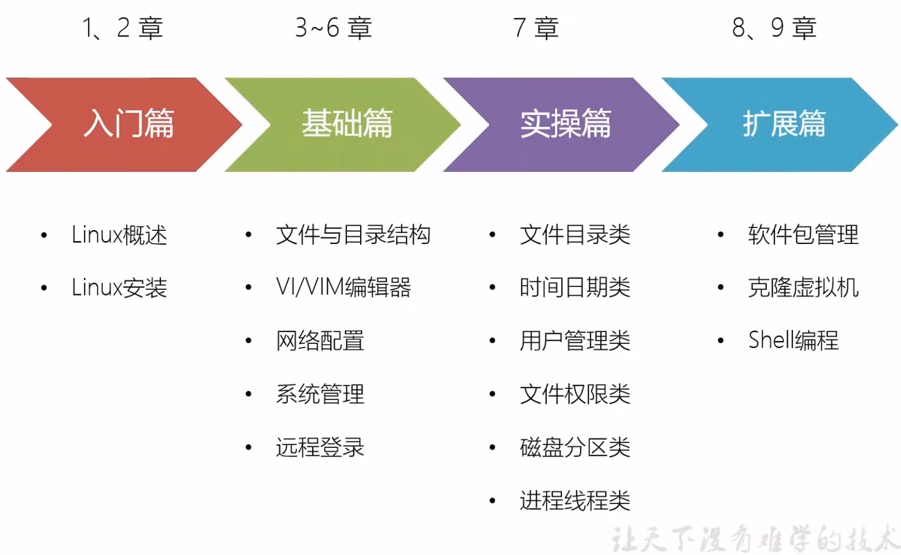

# Linux学习笔记

## 前言

### 基于教程

[3天搞定Linux，1天搞定Shell，清华学神带你通关（2022版）_哔哩哔哩_bilibili](https://www.bilibili.com/video/BV1WY4y1H7d3)

（视频发布时间是2022-04-07，实际内容也非常新，应该是2022年3月份录制的）

### 环境版本

* CentOS 7.9.2009
* VMware Workstation 16 Pro 16.2.2

### 官方网站

[The CentOS Project](https://www.centos.org/)

## 1. 入门篇

### 1.1 介绍

#### 1.1.1 Linux是什么

#### 1.1.2 Linux的发行版

#### 1.1.4 Linux vs Windows

### 1.2 下载安装

CentOS官网的下载页面：https://www.centos.org

CentOS Linux（有别于CentOS Stream）当前最新版本是7-2009，即7.9.2009：http://isoredirect.centos.org/centos/7/isos/x86_64/

VMWare官网：https://www.vmware.com/cn.html

VMware Workstation Pro当前最新版本是16.2.3：https://customerconnect.vmware.com/cn/downloads/details?downloadGroup=WKST-1623-WIN-NEW&productId=1038&rPId=85389

## 基础篇

## 实操篇

## 扩展篇