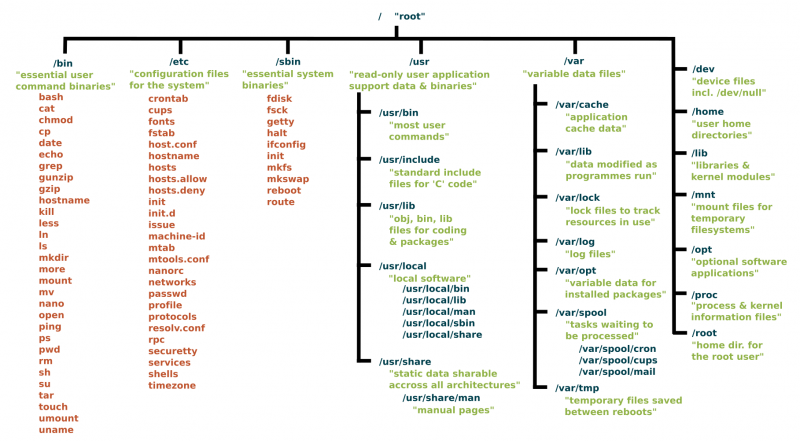

# Linux学习笔记

## 前言

### 基于教程

[3天搞定Linux，1天搞定Shell，清华学神带你通关（2022版）_哔哩哔哩_bilibili](https://www.bilibili.com/video/BV1WY4y1H7d3)

（视频发布时间是2022-04-07，实际内容也非常新，应该是2022年3月份录制的）

### 参考教程

[Linux学习教程，Linux入门教程（超详细）](http://c.biancheng.net/linux_tutorial/)

[Linux 教程 | 菜鸟教程](https://www.runoob.com/linux/linux-tutorial.html)

### 环境版本

* CentOS 7.9.2009
* VMware Workstation 16 Pro 16.2.2

### 官方网站

[The CentOS Project](https://www.centos.org/)

## 1. 入门篇

### 1.1 Linux概述

#### 1.1.1 Linux是什么

我们作为后端开发/运维人员，使用Linux时最经常接触的当然就是shell层。

进入shell有两种方式，一个是原生的shell入口，即控制台模式下的**Linux控制台(Console)** ；另一个是桌面环境封装好的模拟入口（即图形界面模式下的**终端(Terminal)** 。

> 在 Linux 发展的早期，唯一能用的工具就是 Shell，Linux 用户都是在 Shell 中输入文本命令，并查看文本输出；如果有必要的话，Shell 也能显示一些基本的图形。
>
> 而如今 Linux 的环境已经完全不同，<u>几乎所有的 Linux 发行版都使用某种图形桌面环境（例如 GNOME、KDE、Unity 等），这使得原生的 Shell 入口被隐藏了</u>，进入 Shell 仿佛变得困难起来。
>
> 1.
>
> 一种进入 Shell 的方法是让 Linux 系统退出图形界面模式，进入控制台模式，这样一来，显示器上只有一个简单的带着白色文字的“黑屏”，就像图形界面出现之前的样子。这种模式称为 Linux 控制台（Console）。
>
> <u>现代 Linux 系统在启动时会自动创建几个虚拟控制台（Virtual Console），其中一个供图形桌面程序使用，其他的保留原生控制台的样子。虚拟控制台其实就是 Linux 系统内存中运行的虚拟终端（Virtual Terminal）。</u>
>
> 从图形界面模式进入控制台模式也很简单，往往按下`Ctrl + Alt + Fn(n=1,2,3,4,5...)`快捷键就能够来回切换。
>
> 例如，CentOS 在启动时会创建 6 个虚拟控制台，按下快捷键`Ctrl + Alt + Fn(n=2,3,4,5,6)`可以从图形界面模式切换到控制台模式，按下`Ctrl + Alt + F1`可以从控制台模式再切换回图形界面模式。也就是说，1 号控制台被图形桌面程序占用了。
>
> 2.
>
> 进入 Shell 的另外一种方法是使用 Linux 桌面环境中的终端模拟包（Terminal emulation package），也就是我们常说的终端（Terminal），这样在图形桌面中就可以使用 Shell。
>
> 以 CentOS 为例，可以在“应用程序”菜单中找到终端，打开终端后，就可以输入 Shell 命令了。
>
> CentOS 默认的图形界面程序是 GNOME，该终端模拟包也是 GNOME 自带的。
>
> 参考资料：[进入Shell的两种方式](http://c.biancheng.net/view/733.html)

#### 1.1.2 Linux的发行版

#### 1.1.4 Linux vs Windows

### 1.2 Linux安装

CentOS官网的下载页面：https://www.centos.org

**CentOS Linux**（有别于CentOS Stream）当前最新版本是7-2009，即7.9.2009：http://isoredirect.centos.org/centos/7/isos/x86_64/

VMWare官网：https://www.vmware.com/cn.html

**VMware Workstation Pro**当前最新版本是16.2.3：https://customerconnect.vmware.com/cn/downloads/details?downloadGroup=WKST-1623-WIN-NEW&productId=1038&rPId=85389

## 2. 基础篇

### 2.1 Linux文件系统

在Linux中，一切皆文件。

下面的截图是我的Linux虚拟机的根目录结构，总共有19个一级目录，接下来我们全都过一遍。

> ### 目录
>
> #### /bin (binary)
>
> <u>`/bin` 目录是包含一些二进制文件的目录，即可以运行的一些应用程序。</u> 你会在这个目录中找到上面提到的 `ls` 程序，以及用于新建和删除文件和目录、移动它们基本工具。还有其它一些程序，等等。文件系统树的其他部分有更多的 *bin* 目录，但我们将在一会儿讨论这些目录。
>
> #### /sbin (system binary)
>
> <u>`/sbin` 与 `/bin` 类似，但它包含的应用程序只有超级用户（即首字母的 `s` ）才需要。</u>你可以使用 `sudo` 命令使用这些应用程序，该命令暂时允许你在许多 Linux 发行版上拥有超级用户权限。`/sbin` 目录通常包含可以安装、删除和格式化各种东西的工具。你可以想象，如果你使用不当，这些指令中有一些是致命的，所以要小心处理。
>
> #### /usr (unix software resource)
>
> `/usr` 目录是在 UNIX 早期用户的主目录所处的地方。然而，正如我们上面看到的，现在 `/home` 是用户保存他们的东西的地方。如今，`/usr` 包含了大量目录，而这些目录又包含了应用程序、库、文档、壁纸、图标和许多其他需要应用程序和服务共享的内容。
>
> <u>你还可以在 `/usr` 目录下找到 `bin`，`sbin`，`lib` 目录，它们与挂载到根目录下的那些有什么区别呢？现在的区别不是很大。</u>在早期，`/bin` 目录（挂载在根目录下的）只会包含一些基本的命令，例如 `ls`、`mv` 和 `rm` ；这是一些在安装系统的时候就会预装的一些命令，用于维护系统的一个基本的命令。 而 `/usr/bin` 目录则包含了用户自己安装和用于工作的软件，例如文字处理器，浏览器和一些其他的软件。
>
> <u>但是许多现代的 Linux 发行版只是把所有的东西都放到 `/usr/bin` 中，并让 `/bin` 指向 `/usr/bin`，以防彻底删除它会破坏某些东西。</u>因此，Debian、Ubuntu 和 Mint 仍然保持 `/bin` 和 `/usr/bin` （和 `/sbin` 和 `/usr/sbin` ）分离；其他的，比如 Arch 和它衍生版，只是有一个“真实”存储二进制程序的目录，`/usr/bin`，其余的任何 `bin` 目录是指向 `/usr/`bin` 的“假”目录。
>
> #### /lib (library)
>
> `/lib` 是库文件所在的地方。库是包含应用程序可以使用的代码文件。它们包含应用程序用于在桌面上绘制窗口、控制外围设备或将文件发送到硬盘的代码片段。
>
> 在文件系统周围散布着更多的 `lib` 目录，但是这个直接挂载在 `/` 的 `/lib` 目录是特殊的，除此之外，它包含了所有重要的内核模块。 内核模块是使你的显卡、声卡、WiFi、打印机等工作的驱动程序。
>
> #### /boot
>
> `/boot` 目录包含启动系统所需的文件。我必须要说吗？ 好吧，我会说：**不要动它**！ 如果你在这里弄乱了其中一个文件，你可能无法运行你的 Linux，修复被破坏的系统是非常痛苦的一件事。 另一方面，不要太担心无意中破坏系统：你必须拥有超级用户权限才能执行此操作。
>
> > ***Boot* 存放开机文件，一般为100M左右（50M~200M）。**
>
> #### /dev (device)
>
> `/dev` 目录包含设备文件。 其中许多是在启动时或甚至在运行时生成的。 例如，如果你将新的网络摄像头或 USB 随身碟连接到你的机器中，则会自动弹出一个新的设备条目。
>
> #### /etc (everything to configure)
>
> `/etc` 的目录名称会让人变得非常的困惑。`/etc` 得名于最早的 Unix 系统们，它的字面意思是 “etcetera”（诸如此类） ，因为它是系统文件管理员不确定在哪里放置的文件的垃圾场。
>
> 现在，说 `/etc` 是“要配置的所有内容Everything To Configure”更为恰当，因为它包含大部分（如果不是全部的话）的系统配置文件。 例如，包含系统名称、用户及其密码、网络上计算机名称以及硬盘上分区的安装位置和时间的文件都在这里。 再说一遍，如果你是 Linux 的新手，最好是不要在这里接触太多，直到你对系统的工作有更好的理解。
>
> #### /home
>
> `/home` 是你可以找到用户个人目录的地方。在我的情况下，`/home` 下有两个目录：`/home/paul`，其中包含我所有的东西；另外一个目录是 `/home/guest` 目录，以防有客人需要使用我的电脑。
>
> #### /root
>
> `/root` 是系统的超级用户（也称为“管理员”）的主目录。 它与其他用户的主目录是分开的，**因为你不应该动它**。 所以把自己的东西放在你自己的目录中，伙计们。
>
> #### /media
>
> 在 `/media` 目录中，当你插入外部存储器试图访问它时，将自动挂载它。与此列表中的大多数其他项目不同，`/media` 并不追溯到 1970 年代，主要是因为当计算机正在运行而动态地插入和检测存储（U 盘、USB 硬盘、SD 卡、外部 SSD 等)，这是近些年才发生的事。
>
> > *Media* 一般是**系统自动挂载**可移除的装置，挂载后装置图标**会**出现在桌面窗口的左边栏。如软碟、光碟、DVD、U盘、移动硬盘（/media/floppy, /media/cdrom）。
>
> #### /mnt (mount)
>
> 然而，`/mnt` 目录是一些过去的残余。这是你手动挂载存储设备或分区的地方。现在不常用了。
>
> > *Mount* 一般是用于让**用户自己挂载**其他文件系统，挂载后装置图标**不会**出现在桌面窗口的左边栏。
>
> #### /opt (optional)
>
> `/opt` 目录通常是你编译软件（即，你从源代码构建，并不是从你的系统的软件库中安装软件）的地方。应用程序最终会出现在 `/opt/bin` 目录，库会在 `/opt/lib` 目录中出现。
>
> 稍微的题外话：应用程序和库的另一个地方是 `/usr/local`，在这里安装软件时，也会有 `/usr/local/bin` 和 `/usr/local/lib` 目录。开发人员如何配置文件来控制编译和安装过程，这就决定了软件安装到哪个地方。
>
> #### /proc (process)
>
> `/proc`，就像 `/dev` 是一个虚拟目录。它包含有关你的计算机的信息，例如关于你的 CPU 和你的 Linux 系统正在运行的内核的信息。与 `/dev` 一样，文件和目录是在计算机启动或运行时生成的，因为你的系统正在运行且会发生变化。
>
> > *Processes* 正在运行的内核信息映射，主要包括进程信息、内存资源信息、磁盘分区信息等。（虚拟文件系统，不占内存）
>
> #### /run
>
> `/run` 是另一个新出现的目录。系统进程出于自己不可告人的原因使用它来存储临时数据。这是另一个**不要动它**的文件夹。
>
> #### /srv (service)
>
> `/srv` 目录包含服务器的数据。如果你正在 Linux 机器上运行 Web 服务器，你网站的 HTML文件将放到 `/srv/http`（或 `/srv/www`）。 如果你正在运行 FTP 服务器，则你的文件将放到 `/srv/ftp`。
>
> > **/srv ：主要用来存储本机或本服务器提供的服务或数据。**（用户主动生产的数据、对外提供服务）
> >
> > 所以，服务器被用作Web开发时，html文件更应该被放在/srv/www下，而不是/var/www下（因为/srv目录是新标准中才有的，出现较晚；而且Apache将/var/www设为了web默认目录，所以现在绝大多数人都把web文件放在/var/www，这是个历史遗留问题）。
> >
> > 如ftp、流媒体服务等也应该被放在/srv对应的目录下。如果对应目录太大，应该另外挂载分区。
>
> #### /sys
>
> `/sys` 是另一个类似 `/proc` 和 `/dev` 的虚拟目录，它还包含连接到计算机的设备的信息。
>
> 在某些情况下，你还可以操纵这些设备。 例如，我可以通过修改存储在 `/sys/devices/pci0000:00/0000:00:02.0/drm/card1/card1-eDP-1/intel_backlight/brightness` 中的值来更改笔记本电脑屏幕的亮度（在你的机器上你可能会有不同的文件）。但要做到这一点，你必须成为超级用户。原因是，与许多其它虚拟目录一样，在 `/sys` 中打乱内容和文件可能是危险的，你可能会破坏系统。直到你确信你知道你在做什么。否则不要动它。
>
> > *System* 正在运行的硬件设备的驱动程序信息。（虚拟文件系统，不占内存）
>
> #### /tmp (temporary)
>
> `/tmp` 包含临时文件，通常由正在运行的应用程序放置。文件和目录通常（并非总是）包含应用程序现在不需要但以后可能需要的数据。
>
> 你还可以使用 `/tmp` 来存储你自己的临时文件 —— `/tmp` 是少数挂载到根目录下而你可以在不成为超级用户的情况下与它进行实际交互的目录之一。
>
> > **/tmp ：保存在使用完毕后可随时销毁的缓存文件。**（有可能是由系统或程序产生、也有可能是用户主动放入的临时数据、系统会自动清理）
>
> #### /var (variable)
>
> `/var` 最初被如此命名是因为它的内容被认为是可变的variable，因为它经常变化。今天，它有点用词不当，因为还有许多其他目录也包含频繁更改的数据，特别是我们上面看到的虚拟目录。
>
> 不管怎样，`/var` 目录包含了放在 `/var/log` 子目录的日志文件之类。日志是记录系统中发生的事件的文件。如果内核中出现了什么问题，它将被记录到 `/var/log` 下的文件中；如果有人试图从外部侵入你的计算机，你的防火墙也将记录尝试。它还包含用于任务的假脱机程序。这些“任务”可以是你发送给共享打印机必须等待执行的任务，因为另一个用户正在打印一个长文档，或者是等待递交给系统上的用户的邮件。
>
> > **/var ：系统产生的不可自动销毁的缓存文件、日志记录。**（系统和程序运行后产生的数据、不对外提供服务、只能用户手动清理）（包括mail、数据库文件、日志文件）
>
> ### 更深入的研究
>
> 这里仅仅谈了根目录，但是许多子目录都指向它们自己的一组文件和子目录。图 2 给出了基本文件系统的总体概念（图片是在 Paul Gardner 的 CC BY-SA 许可下提供的），Wikipedia 对每个目录的用途进行了总结。
>
> 
>
> *图 2：标准 Unix 文件系统*
>
> 要自行探索文件系统，请使用 `cd` 命令：`cd`将带你到你所选择的目录（ `cd` 代表更改目录）。
>
> 如果你不知道你在哪儿，`pwd`会告诉你，你到底在哪里，（ `pwd` 代表打印工作目录 ），同时 `cd`命令在没有任何选项或者参数的时候，将会直接带你到你自己的主目录，这是一个安全舒适的地方。
>
> 最后，`cd ..`将会带你到上一层目录，会使你更加接近根目录，如果你在 `/usr/share/wallpapers` 目录，然后你执行 `cd ..` 命令，你将会跳转到 `/usr/share` 目录
>
> 要查看目录里有什么内容，使用 `ls` 或这简单的使用 `l` 列出你所在目录的内容。
>
> 当然，你总是可以使用 `tree` 来获得目录中内容的概述。在 `/usr/share` 上试试——里面有很多有趣的东西。
>
> ### 总结
>
> 尽管 Linux 发行版之间存在细微差别，但它们的文件系统的布局非常相似。 你可以这么说：一旦你了解一个，你就会都了解了。 了解文件系统的最好方法就是探索它。 因此，伴随 `tree` ，`ls` 和 `cd` 进入未知的领域吧。
>
> 你不会只是因为查看文件系统就破坏了文件系统，因此请从一个目录移动到另一个目录并进行浏览。 很快你就会发现 Linux 文件系统及其布局的确很有意义，并且你会直观地知道在哪里可以找到应用程序，文档和其他资源。
>
> 参考资料：
>
> * [技术|Linux 文件系统详解](https://linux.cn/article-9798-1.html)
> * [关于linux下/srv、/var和/tmp的职责区分_frcoder的博客-CSDN博客_linux中srv](https://blog.csdn.net/u012107143/article/details/54972544)
> * [linux常见分区及各目录作用与全称_frcoder的博客-CSDN博客](https://blog.csdn.net/u012107143/article/details/54973028)

### 2.2 VIM编辑器

VI是Unix操作系统和类Unix操作系统中最通用的文本编辑器。（白底黑字）

VIM编辑器是从VI发展出来的一个性能更强大的文本编辑器，VIM与VI编辑器完全兼容。（字体颜色区分）

基本上 vi/vim 共分为三种模式，分别是**命令模式（Command mode）**，**输入模式（Insert mode）**和**底线命令模式（Last line mode）**。

*具体的命令和操作方式非常多，这里就不写了，用得多了自然会记住。用到的时候直接百度或者查一些速记手册即可。*

### 2.3 网络配置

#### 2.3.1 ifconfig

要使Linux虚拟机与物理主机相互连通，就必须得到虚拟机的ip地址。

可以在shell中使用`ifconfig`(networks interfaces configuring)命令查看和配置网卡接口。

扩展资料：

[Linux下 ifconfig 命令的使用（Linux命令）_hrx-@@的博客-CSDN博客_linuxifconfig用法](https://blog.csdn.net/lang523493505/article/details/107242769)

[理解物理网卡、网卡接口、内核、IP等属性的关系 - 云+社区 - 腾讯云](https://cloud.tencent.com/developer/article/1662501)

#### 2.3.2 网络连接方式

VMware提供了三种网络连接方式。

* *VMware-编辑-虚拟网络编辑器-更改设置*

  

* *控制面板-网络和Internet-网络连接*

  

##### 桥接模式

虚拟机直接连接外部物理网络，主机起到了网桥的作用。这种模式下，虚拟机可以直接访问外部网络，并且对外部网络是可见的。

##### NAT模式

虚拟机喝主机构建一个专用网络，并通过虚拟网络地址转换（NAT）设备对IP进行转换。虚拟机通过共享主机IP可以访问外部网络，但外部网络无法访问虚拟机。

##### 仅主机模式

虚拟机只与主机共享一个专用网络，与外部网络无法通信。

