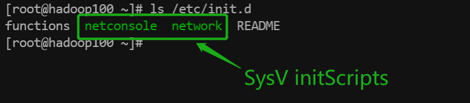

# Linux学习笔记

## TODO

2.3.4为什么要配置主机名

## 前言

### 基于教程

[3天搞定Linux，1天搞定Shell，清华学神带你通关（2022版）_哔哩哔哩_bilibili](https://www.bilibili.com/video/BV1WY4y1H7d3)

（视频发布时间是2022-04-07，实际内容也非常新，应该是2022年3月份录制的）

### 参考教程

[Linux学习教程，Linux入门教程（超详细） - C语言中文网](http://c.biancheng.net/linux_tutorial/)

[Shell脚本：Linux Shell脚本学习指南（超详细） - C语言中文网](http://c.biancheng.net/shell/)

[Linux 教程 | 菜鸟教程](https://www.runoob.com/linux/linux-tutorial.html)

[Linux 命令大全 | 菜鸟教程](https://www.runoob.com/linux/linux-command-manual.html)

[Linux 中国◆开源社区](https://linux.cn/)

### 环境版本

* CentOS 7.9.2009
* VMware Workstation 16 Pro 16.2.2

### 官方网站

[The CentOS Project](https://www.centos.org/)

## 1. 入门篇

### 1.1 Linux概述

#### 1.1.1 Linux是什么


我们作为后端开发/运维人员，使用Linux时最经常接触的当然就是Shell层。

进入Shell有两种方式，一个是原生的Shell入口，即控制台模式下的**Linux控制台(Console)** ；另一个是桌面环境封装好的模拟入口（即图形界面模式下的**终端(Terminal)** 。

> 在 Linux 发展的早期，唯一能用的工具就是 Shell，Linux 用户都是在 Shell 中输入文本命令，并查看文本输出；如果有必要的话，Shell 也能显示一些基本的图形。
>
> 而如今 Linux 的环境已经完全不同，<u>几乎所有的 Linux 发行版都使用某种图形桌面环境（例如 GNOME、KDE、Unity 等），这使得原生的 Shell 入口被隐藏了</u>，进入 Shell 仿佛变得困难起来。
>
> 1.
>
> 一种进入 Shell 的方法是让 Linux 系统退出图形界面模式，进入控制台模式，这样一来，显示器上只有一个简单的带着白色文字的“黑屏”，就像图形界面出现之前的样子。这种模式称为 Linux 控制台（Console）。
>
> <u>现代 Linux 系统在启动时会自动创建几个虚拟控制台（Virtual Console），其中一个供图形桌面程序使用，其他的保留原生控制台的样子。虚拟控制台其实就是 Linux 系统内存中运行的虚拟终端（Virtual Terminal）。</u>
>
> 从图形界面模式进入控制台模式也很简单，往往按下`Ctrl + Alt + Fn(n=1,2,3,4,5...)`快捷键就能够来回切换。
>
> 例如，CentOS 在启动时会创建 6 个虚拟控制台，按下快捷键`Ctrl + Alt + Fn(n=2,3,4,5,6)`可以从图形界面模式切换到控制台模式，按下`Ctrl + Alt + F1`可以从控制台模式再切换回图形界面模式。也就是说，1 号控制台被图形桌面程序占用了。
>
> 2.
>
> 进入 Shell 的另外一种方法是使用 Linux 桌面环境中的终端模拟包（Terminal emulation package），也就是我们常说的终端（Terminal），这样在图形桌面中就可以使用 Shell。
>
> 以 CentOS 为例，可以在“应用程序”菜单中找到终端，打开终端后，就可以输入 Shell 命令了。
>
> CentOS 默认的图形界面程序是 GNOME，该终端模拟包也是 GNOME 自带的。
>
> 参考资料：[进入Shell的两种方式](http://c.biancheng.net/view/733.html)

#### 1.1.2 Linux的发行版


#### 1.1.4 Linux vs Windows


### 1.2 Linux安装

CentOS官网的下载页面：https://www.centos.org

**CentOS Linux**（有别于CentOS Stream）当前最新版本是7-2009，即7.9.2009：http://isoredirect.centos.org/centos/7/isos/x86_64/

VMWare官网：https://www.vmware.com/cn.html

**VMware Workstation Pro**当前最新版本是16.2.3：https://customerconnect.vmware.com/cn/downloads/details?downloadGroup=WKST-1623-WIN-NEW&productId=1038&rPId=85389

## 2. 基础篇

### 2.1 Linux文件系统

在Linux中，一切皆文件。

下面的截图是我的Linux虚拟机的根目录结构，总共有19个一级目录，接下来我们全都过一遍。


> ### 目录
>
> #### /bin (binary)
>
> <u>`/bin` 目录是包含一些二进制文件的目录，即可以运行的一些应用程序。</u> 你会在这个目录中找到上面提到的 `ls` 程序，以及用于新建和删除文件和目录、移动它们基本工具。还有其它一些程序，等等。文件系统树的其他部分有更多的 *bin* 目录，但我们将在一会儿讨论这些目录。
>
> #### /sbin (system binary)
>
> <u>`/sbin` 与 `/bin` 类似，但它包含的应用程序只有超级用户（即首字母的 `s` ）才需要。</u>你可以使用 `sudo` 命令使用这些应用程序，该命令暂时允许你在许多 Linux 发行版上拥有超级用户权限。`/sbin` 目录通常包含可以安装、删除和格式化各种东西的工具。你可以想象，如果你使用不当，这些指令中有一些是致命的，所以要小心处理。
>
> #### /usr (unix software resource)
>
> `/usr` 目录是在 UNIX 早期用户的主目录所处的地方。然而，正如我们上面看到的，现在 `/home` 是用户保存他们的东西的地方。如今，`/usr` 包含了大量目录，而这些目录又包含了应用程序、库、文档、壁纸、图标和许多其他需要应用程序和服务共享的内容。
>
> <u>你还可以在 `/usr` 目录下找到 `bin`，`sbin`，`lib` 目录，它们与挂载到根目录下的那些有什么区别呢？现在的区别不是很大。</u>在早期，`/bin` 目录（挂载在根目录下的）只会包含一些基本的命令，例如 `ls`、`mv` 和 `rm` ；这是一些在安装系统的时候就会预装的一些命令，用于维护系统的一个基本的命令。 而 `/usr/bin` 目录则包含了用户自己安装和用于工作的软件，例如文字处理器，浏览器和一些其他的软件。
>
> <u>但是许多现代的 Linux 发行版只是把所有的东西都放到 `/usr/bin` 中，并让 `/bin` 指向 `/usr/bin`，以防彻底删除它会破坏某些东西。</u>因此，Debian、Ubuntu 和 Mint 仍然保持 `/bin` 和 `/usr/bin` （和 `/sbin` 和 `/usr/sbin` ）分离；其他的，比如 Arch 和它衍生版，只是有一个“真实”存储二进制程序的目录，`/usr/bin`，其余的任何 `bin` 目录是指向 `/usr/`bin` 的“假”目录。
>
> #### /lib (library)
>
> `/lib` 是库文件所在的地方。库是包含应用程序可以使用的代码文件。它们包含应用程序用于在桌面上绘制窗口、控制外围设备或将文件发送到硬盘的代码片段。
>
> 在文件系统周围散布着更多的 `lib` 目录，但是这个直接挂载在 `/` 的 `/lib` 目录是特殊的，除此之外，它包含了所有重要的内核模块。 内核模块是使你的显卡、声卡、WiFi、打印机等工作的驱动程序。
>
> #### /boot
>
> `/boot` 目录包含启动系统所需的文件。我必须要说吗？ 好吧，我会说：**不要动它**！ 如果你在这里弄乱了其中一个文件，你可能无法运行你的 Linux，修复被破坏的系统是非常痛苦的一件事。 另一方面，不要太担心无意中破坏系统：你必须拥有超级用户权限才能执行此操作。
>
> > ***Boot* 存放开机文件，一般为100M左右（50M~200M）。**
>
> #### /dev (device)
>
> `/dev` 目录包含设备文件。 其中许多是在启动时或甚至在运行时生成的。 例如，如果你将新的网络摄像头或 USB 随身碟连接到你的机器中，则会自动弹出一个新的设备条目。
>
> #### /etc (everything to configure)
>
> `/etc` 的目录名称会让人变得非常的困惑。`/etc` 得名于最早的 Unix 系统们，它的字面意思是 “etcetera”（诸如此类） ，因为它是系统文件管理员不确定在哪里放置的文件的垃圾场。
>
> 现在，说 `/etc` 是“要配置的所有内容Everything To Configure”更为恰当，因为它包含大部分（如果不是全部的话）的系统配置文件。 例如，包含系统名称、用户及其密码、网络上计算机名称以及硬盘上分区的安装位置和时间的文件都在这里。 再说一遍，如果你是 Linux 的新手，最好是不要在这里接触太多，直到你对系统的工作有更好的理解。
>
> #### /home
>
> `/home` 是你可以找到用户个人目录的地方。在我的情况下，`/home` 下有两个目录：`/home/paul`，其中包含我所有的东西；另外一个目录是 `/home/guest` 目录，以防有客人需要使用我的电脑。
>
> #### /root
>
> `/root` 是系统的超级用户（也称为“管理员”）的主目录。 它与其他用户的主目录是分开的，**因为你不应该动它**。 所以把自己的东西放在你自己的目录中，伙计们。
>
> #### /media
>
> 在 `/media` 目录中，当你插入外部存储器试图访问它时，将自动挂载它。与此列表中的大多数其他项目不同，`/media` 并不追溯到 1970 年代，主要是因为当计算机正在运行而动态地插入和检测存储（U 盘、USB 硬盘、SD 卡、外部 SSD 等)，这是近些年才发生的事。
>
> > *Media* 一般是**系统自动挂载**可移除的装置，挂载后装置图标**会**出现在桌面窗口的左边栏。如软碟、光碟、DVD、U盘、移动硬盘（/media/floppy, /media/cdrom）。
>
> #### /mnt (mount)
>
> 然而，`/mnt` 目录是一些过去的残余。这是你手动挂载存储设备或分区的地方。现在不常用了。
>
> > *Mount* 一般是用于让**用户自己挂载**其他文件系统，挂载后装置图标**不会**出现在桌面窗口的左边栏。
>
> #### /opt (optional)
>
> `/opt` 目录通常是你编译软件（即，你从源代码构建，并不是从你的系统的软件库中安装软件）的地方。应用程序最终会出现在 `/opt/bin` 目录，库会在 `/opt/lib` 目录中出现。
>
> 稍微的题外话：应用程序和库的另一个地方是 `/usr/local`，在这里安装软件时，也会有 `/usr/local/bin` 和 `/usr/local/lib` 目录。开发人员如何配置文件来控制编译和安装过程，这就决定了软件安装到哪个地方。
>
> #### /proc (process)
>
> `/proc`，就像 `/dev` 是一个虚拟目录。它包含有关你的计算机的信息，例如关于你的 CPU 和你的 Linux 系统正在运行的内核的信息。与 `/dev` 一样，文件和目录是在计算机启动或运行时生成的，因为你的系统正在运行且会发生变化。
>
> > *Processes* 正在运行的内核信息映射，主要包括进程信息、内存资源信息、磁盘分区信息等。（虚拟文件系统，不占内存）
>
> #### /run
>
> `/run` 是另一个新出现的目录。系统进程出于自己不可告人的原因使用它来存储临时数据。这是另一个**不要动它**的文件夹。
>
> #### /srv (service)
>
> `/srv` 目录包含服务器的数据。如果你正在 Linux 机器上运行 Web 服务器，你网站的 HTML文件将放到 `/srv/http`（或 `/srv/www`）。 如果你正在运行 FTP 服务器，则你的文件将放到 `/srv/ftp`。
>
> > **/srv ：主要用来存储本机或本服务器提供的服务或数据。**（用户主动生产的数据、对外提供服务）
> >
> > 所以，服务器被用作Web开发时，html文件更应该被放在/srv/www下，而不是/var/www下（因为/srv目录是新标准中才有的，出现较晚；而且Apache将/var/www设为了web默认目录，所以现在绝大多数人都把web文件放在/var/www，这是个历史遗留问题）。
> >
> > 如ftp、流媒体服务等也应该被放在/srv对应的目录下。如果对应目录太大，应该另外挂载分区。
>
> #### /sys
>
> `/sys` 是另一个类似 `/proc` 和 `/dev` 的虚拟目录，它还包含连接到计算机的设备的信息。
>
> 在某些情况下，你还可以操纵这些设备。 例如，我可以通过修改存储在 `/sys/devices/pci0000:00/0000:00:02.0/drm/card1/card1-eDP-1/intel_backlight/brightness` 中的值来更改笔记本电脑屏幕的亮度（在你的机器上你可能会有不同的文件）。但要做到这一点，你必须成为超级用户。原因是，与许多其它虚拟目录一样，在 `/sys` 中打乱内容和文件可能是危险的，你可能会破坏系统。直到你确信你知道你在做什么。否则不要动它。
>
> > *System* 正在运行的硬件设备的驱动程序信息。（虚拟文件系统，不占内存）
>
> #### /tmp (temporary)
>
> `/tmp` 包含临时文件，通常由正在运行的应用程序放置。文件和目录通常（并非总是）包含应用程序现在不需要但以后可能需要的数据。
>
> 你还可以使用 `/tmp` 来存储你自己的临时文件 —— `/tmp` 是少数挂载到根目录下而你可以在不成为超级用户的情况下与它进行实际交互的目录之一。
>
> > **/tmp ：保存在使用完毕后可随时销毁的缓存文件。**（有可能是由系统或程序产生、也有可能是用户主动放入的临时数据、系统会自动清理）
>
> #### /var (variable)
>
> `/var` 最初被如此命名是因为它的内容被认为是可变的variable，因为它经常变化。今天，它有点用词不当，因为还有许多其他目录也包含频繁更改的数据，特别是我们上面看到的虚拟目录。
>
> 不管怎样，`/var` 目录包含了放在 `/var/log` 子目录的日志文件之类。日志是记录系统中发生的事件的文件。如果内核中出现了什么问题，它将被记录到 `/var/log` 下的文件中；如果有人试图从外部侵入你的计算机，你的防火墙也将记录尝试。它还包含用于任务的假脱机程序。这些“任务”可以是你发送给共享打印机必须等待执行的任务，因为另一个用户正在打印一个长文档，或者是等待递交给系统上的用户的邮件。
>
> > **/var ：系统产生的不可自动销毁的缓存文件、日志记录。**（系统和程序运行后产生的数据、不对外提供服务、只能用户手动清理）（包括mail、数据库文件、日志文件）
>
> ### 更深入的研究
>
> 这里仅仅谈了根目录，但是许多子目录都指向它们自己的一组文件和子目录。图 2 给出了基本文件系统的总体概念（图片是在 Paul Gardner 的 CC BY-SA 许可下提供的），Wikipedia 对每个目录的用途进行了总结。
>
> 
>
> *图 2：标准 Unix 文件系统*
>
> 要自行探索文件系统，请使用 `cd` 命令：`cd`将带你到你所选择的目录（ `cd` 代表更改目录）。
>
> 如果你不知道你在哪儿，`pwd`会告诉你，你到底在哪里，（ `pwd` 代表打印工作目录 ），同时 `cd`命令在没有任何选项或者参数的时候，将会直接带你到你自己的主目录，这是一个安全舒适的地方。
>
> 最后，`cd ..`将会带你到上一层目录，会使你更加接近根目录，如果你在 `/usr/share/wallpapers` 目录，然后你执行 `cd ..` 命令，你将会跳转到 `/usr/share` 目录
>
> 要查看目录里有什么内容，使用 `ls` 或这简单的使用 `l` 列出你所在目录的内容。
>
> 当然，你总是可以使用 `tree` 来获得目录中内容的概述。在 `/usr/share` 上试试——里面有很多有趣的东西。
>
> ### 总结
>
> 尽管 Linux 发行版之间存在细微差别，但它们的文件系统的布局非常相似。 你可以这么说：一旦你了解一个，你就会都了解了。 了解文件系统的最好方法就是探索它。 因此，伴随 `tree` ，`ls` 和 `cd` 进入未知的领域吧。
>
> 你不会只是因为查看文件系统就破坏了文件系统，因此请从一个目录移动到另一个目录并进行浏览。 很快你就会发现 Linux 文件系统及其布局的确很有意义，并且你会直观地知道在哪里可以找到应用程序，文档和其他资源。
>
> 参考资料：
>
> * [技术|Linux 文件系统详解](https://linux.cn/article-9798-1.html)
> * [关于linux下/srv、/var和/tmp的职责区分_frcoder的博客-CSDN博客_linux中srv](https://blog.csdn.net/u012107143/article/details/54972544)
> * [linux常见分区及各目录作用与全称_frcoder的博客-CSDN博客](https://blog.csdn.net/u012107143/article/details/54973028)

### 2.2 vi/vim编辑器

VI是Unix操作系统和类Unix操作系统中最通用的文本编辑器。（白底黑字）

VIM编辑器是从VI发展出来的一个性能更强大的文本编辑器，VIM与VI编辑器完全兼容。（字体颜色区分）

基本上 vi/vim 共分为三种模式，分别是**命令模式（Command mode）**，**输入模式（Insert mode）**和**底线命令模式（Last line mode）**。

*具体的命令和操作方式非常多，这里就不写了，用得多了自然会记住。用到的时候直接百度或者查一些速记手册即可。*

### 2.3 网络配置

#### 2.3.1 ifconfig

要使Linux虚拟机与物理主机相互连通，就必须得到虚拟机的ip地址。

可以在Shell中使用`ifconfig`(networks interfaces configuring)命令查看和配置网卡接口。

扩展资料：

[Linux下 ifconfig 命令的使用（Linux命令）_hrx-@@的博客-CSDN博客_linuxifconfig用法](https://blog.csdn.net/lang523493505/article/details/107242769)

[理解物理网卡、网卡接口、内核、IP等属性的关系 - 云+社区 - 腾讯云](https://cloud.tencent.com/developer/article/1662501)

#### 2.3.2 网络连接方式

VMware提供了三种网络连接方式。

* *VMware-编辑-虚拟网络编辑器-更改设置*

  

* *控制面板-网络和Internet-网络连接*

  

##### 桥接模式

虚拟机直接连接外部物理网络，主机起到了网桥的作用。这种模式下，虚拟机可以直接访问外部网络，并且对外部网络是可见的。


##### NAT模式

虚拟机和主机构建一个专用网络，并通过虚拟网络地址转换（NAT）设备对IP进行转换。虚拟机通过共享主机IP可以访问外部网络，但外部网络无法访问虚拟机。


##### 仅主机模式

虚拟机只与主机共享一个专用网络，与外部网络无法通信。


#### 2.3.3 配置静态IP

为什么要配置静态IP？为什么不用默认的“自动获取IP”？因为我们不希望作为服务器的（被访问的）机器的IP是变化的。

##### 图形化界面方式

*应用程序-系统工具-设置-网络-有线-设置图标-IPv4-IPv4 Method*

选择“手动”，即可配置IP地址、子网掩码、网关。

##### Shell方式

修改ifcfg-ens33，即修改"ens33"这个"if"(network interface)的"cfg"(configuration)。

```shell
vim /etc/sysconfig/network-srcipts/ifcfg-ens33
```

注意静态IP的网络号要符合实际

```
...
# 这里原来是dhcp
BOOTPROTO="static"
...
# 下面几行是为了配置静态IP而新增的
IPADDR=192.168.150.100
NETMASK=255.255.255.0
GATEWAY=192.168.150.2
DNS1=192.168.150.2
```

重启网络

```shell
service network restart
```

#### 2.3.4 配置主机名

##### 查看主机名

其实在Shell中已经自然地显示主机名了，就像这样：

`[用户名@主机名 当前目录]#或$ 光标所在处`

当然你也可以主动通过命令查看：

```shell
# 显示hostname
hostname
# 显示hostname相关信息（hostname control）
hostnamectl	#hostnamectl status
```

##### 修改配置文件方式

```shell
# 里面唯一的内容就是主机名，直接修改即可
vim /etc/hostname
# 重启
reboot
```

##### 命令方式

```shell
# 修改主机名，立即生效
hostnamectl set-hostname newhostname
```

> hostnamectl命令来自于英文词组“hostname control”的缩写，其功能是用于显示与设置主机名称。基于/etc/hostname文件修改主机名称需要重启服务器后才可生效，而hostnamectl命令设置过的主机名称可以立即生效，效率更高。
>
> **语法格式**：hostnamectl [参数]
>
> **常用参数**：
>
> | 参数         | 含义               |
> | ------------ | ------------------ |
> | -H           | 操作远程主机       |
> | status       | 显示当前主机名设置 |
> | set-hostname | 设置系统主机名     |
>
> 参考资料：[hostnamectl命令 – 显示与设置主机名称 – Linux命令大全(手册)](https://www.linuxcool.com/hostnamectl)

##### 为什么要配置主机名？TODO

主机名host name和域名domain name是有区别的，但是这里还有一个完整域名(Fully Qualified Domain Name, FQDN)的概念。

> 如果你有一个服务器，绑定了多个域名：
>
> - guoyunhe.me
> - www.guoyunhe.me
> - wiki.guoyunhe.me
> - shop.guoyunhe.me
>
> 你可以选择 “www”， “wiki” 和 “shop” 中的任何一个作为主机名。也可以另取一个，比如 “server” ， “vps-1″。
>
> **第 1 步**：修改 **/etc/hostname** 文件。主机名只能包含数字，字母和连字符。
>
> ```
> server
> ```
>
> **第 2 步**：修改 **/etc/hosts** 文件。把完整域名 FQDN “server.guoyunhe.me” 放到主机名 “server” 之前。
>
> ```
> 127.0.0.1    localhost
> 127.0.1.1    server.guoyunhe.me server guoyunhe.me www.guoyunhe.me wiki.guoyunhe.me shop.guoyunhe.me
> ```
>
> **第 3 步**：重启系统。
>
> 检查主机名和域名： “**hostname**” 命令输出 server ， “**hostname -f**” 输出 server.guoyunhe.me 。
>
> 参考资料：[正确设置 GNU/Linux 主机名 Hostname 和域名 Domain – 鹤仙人](https://guoyunhe.me/2016/08/25/set-hostname-and-domain-name-correctly/)

举个例子：

* baidu.com——域名
* www——主机名（默认，可缺省）
* www.baidu.com——完整域名

> 讲一个故事：刚开始，我发明了互联网通信(即在网上传输东西)，互联网通信是发生在TCP/IP协议之上(即这个协议是互联网通信的基础之一，TCP像车子，IP类似房子的地址)。IP就是上面说的这个TCP/IP协议的产物，有了他就可以想和谁通信就和谁通信，于是很多人开始把IP记住来通信，但是我发现很多人对数字不敏感，他们都说IP不好记。后来，我就发明了DNS解析，域名就是DNS的产物，如baidu.com就是一个域名，这个比那些IP的数字好记忆很多，得到了很多人的认可，他们不用再输入IP了，直接输入baidu.com就可以通信了，很开心。那么有人很好奇，就问：“域名能用了，那IP是不是就没法用了啊？”，我回答：“有啊，你回去输入IP试一试，和以前一样的。”。有人问：“那域名怎么就能通信了？”，我说：“因为我发明了的DNS帮了大忙，他把域名变成IP了啊:D”。有人问：“那域名不会重复吗？”，我回答：“不可能，我规定了不能重复，注册的时候都记录在本子上了，绝对不会重复。一句话，DNS让域名不会重复，懂了吗？”。有一天，有人跑过来问我，兴奋地说：“我发现了一个好玩的事情，我输入[www.baidu.com](http://www.baidu.com/)和baidu.com都能访问，为什么啊？”，我说：“你是否发现了多出一个www的东西？其实它叫'主机名'。”。 他又问：“那主机名有什么用？我不加www这个主机名，也可以通信(这里指上网)，那这个主机名不是没有作用了吗？还占用了位置呢，害我多输入几个字母。”。我说：“哈哈，不是没用，而是你用的机会少，但你用的机会少，你没用过，不代表他没有用啊。认知限制了你的想法啊~。在这里，我先把'主机'比作'房间'，你用baidu.com这个域名可以找到我的'房子'，但是你开了大门，进来的是我的'房子'的一个'房间'，这个就是'www房间'，是我在DNS规定的默认的缺省的'房间'，即你不填上主机(可以比作房间名或房间号)，默认就到这个'www房间'。而我还有其他的'房间'啊，我还有'a房间'、'b房间'、'Z房间'等等。你说你要进来'a房间'?容易啊，你加上主机(房间号)就可以啦，就是说你输入a.baidu.com就行啦。”。最后，还有人问我：“为什么默认是'www'啊？”。我说：“打个比方，我反问你一个问题：为什么你会说话的时候，叫你父亲作'爸爸'啊？”。 有人会回答是习惯。对，是习惯，习惯用'www'作为默认。 补充一点"不知道顶级域名的定义的请自行查阅资料"。好了，我把我的理解用文字说出来了，还有不懂，请追问：D
> 参考资料：[有一个人说网址前面的www是主机名？主机？我懵了_百度知道](https://zhidao.baidu.com/question/461162404144932445.html)

### 2.4 远程管理

> 提到远程管理，通常指的是远程管理服务器，而非个人计算机。个人计算机可以随时拿来用，服务器通常放置在机房中，用户无法直接接触到服务器硬件，只能采用远程管理的方式。
>
> 远程管理，实际上就是计算机（服务器）之间通过网络进行数据传输（信息交换）的过程，与浏览器需要 HTTP 协议（超文本传输协议）浏览网页一样，远程管理同样需要远程管理协议的支持。
>
> 目前，常用的远程管理协议有以下 4 种：
>
> - RDP（remote desktop protocol）协议：远程桌面协议，大部分 Windows 系统都默认支持此协议，Windows 系统中的远程桌面管理就基于该协议。
> - RFB（Remote FrameBuffer）协议：图形化远程管理协议，VNC 远程管理工具就基于此协议。
> - Telnet：命令行界面远程管理协议，几乎所有的操作系统都默认支持此协议。此协议的特点是，在进行数据传送时使用明文传输的方式，也就是不对数据进行加密。
> - SSH（Secure Shell）协议：命令行界面远程管理协议，几乎所有操作系统都默认支持此协议。和 Telnet 不同，该协议在数据传输时会对数据进行加密并压缩，因此使用此协议传输数据既安全速度又快。
>
> 参考资料：[Linux远程管理协议（RFB、RDP、Telnet和SSH）](http://c.biancheng.net/view/2845.html)

远程管理Linux服务器虽然有多种方式，但大多是基于SSH协议。

当然，在连接之前需要在客户机的hosts文件中配置好主机名与IP地址的映射，方便访问。

#### 2.4.1 Windows命令行方式

`ssh 用户名@IP地址/已在hosts中映射的主机名/已在hosts中映射的域名`

#### 2.4.2 远程管理工具

市面上有很多，但要么是收费的，要么界面难看，要么不仅是收费的而且界面难看。

我推荐一个国产的免费工具——**Aechoterm，免费、UI简单好看、基本功能齐全（支持SSH和SFTP）**，上手体验大有当初第一次使用Apifox的感觉，如沐春风，十分舒适。

官网：https://ec.nantian.com.cn/#/home

官网文档/功能演示：https://ec.nantian.com.cn/#/about

### 2.5 系统管理

#### 2.5.1 进程与服务

系统中正在执行的程序，叫做“进程”（process）

系统启动后一直存在并常驻内存的进程，叫做“服务”（service）。这样的进程又称“守护进程”（daement process），这样的服务又称“系统服务”，在Linux系统中，这两个概念说的其实是一回事。

#### 2.5.2 service命令

适用于CentOS 6之前的版本，虽然新版本的CentOS仍然向下兼容该命令，但实际上能管理的服务很少，所以了解即可。

**基本语法**

```shell
service 服务名 start|stop|restart|status    # 开启服务|停止服务|重启服务|查看服务状态
```

**查看服务**

```shell
ls /etc/init.d    # init.d的d就是daemon
```



#### 2.5.3 systemctl命令

**基本语法**

```shell
systemctl start|stop|restart|status 服务名.service    # 开启服务|停止服务|重启服务|查看服务状态
systemctl start|stop|restart|status 服务名            # .service可以省略
```

**查看服务**

```shell
ls /usr/lib/systemd    # systemd的d就是daemon
ls /usr/lib/systemd/system
```


> RHEL/CentOS 7.0中一个最主要的改变，就是切换到了systemd。它用于替代红帽企业版Linux前任版本中的SysV和Upstart，对系统和服务进行管理。systemd兼容SysV和Linux标准组的启动脚本。
>
> Systemd是一个Linux操作系统下的系统和服务管理器。它被设计成向后兼容SysV启动脚本，并提供了大量的特性，如开机时平行启动系统服务，按需启动守护进程，支持系统状态快照，或者基于依赖的服务控制逻辑。
>
> <u>先前的使用SysV初始化或Upstart的红帽企业版Linux版本中，使用位于/etc/rc.d/init.d/目录中的bash初始化脚本进行管理。而在RHEL 7/CentOS 7中，这些启动脚本被服务单元取代了。服务单元以.service文件扩展结束，提供了与初始化脚本同样的用途。要查看、启动、停止、重启、启用或者禁用系统服务，你要使用systemctl来代替旧的service命令。</u>
> systemd是服务管理程序，他整合了service和chkconfig的功能为一体，可以永久性或只在当前会话中启用/禁用服务。
> 参考资料：https://blog.csdn.net/wzyzzu/article/details/44171319

#### 2.5.4 系统运行级别

**CentOS 6**的7个运行级别：

* **runlevel 0 Halt 停机模式**。系统默认运行级别不能设置为0，否则电脑一开机就会关机，无法正常启动。
* **runlevel 1 Single user mode 单用户模式**，只允许root用户登录，但也可以绕过登录验证。主要用于系统维护，禁止远程登陆。
* **runlevel 2 Multiuser, without NFS 多用户模式**，没有网络文件系统（NFS）支持。
* **runlevel 3 Full multiuser mode 完全多用户模式**，有网络文件系统（NFS）支持。用户登录后会进入控制台模式的黑框框，在没有网络的环境下等同于运行级别2。
* **runlevel 4 Unused 系统未使用**。在某些特殊情况下会用到，例如在笔记本电脑的电池用尽时，可以切换到这一模式来做一些设置。
* **runlevel 5 X11 图形界面模式**
* **runlevel 6 Reboot 重启模式**。系统默认运行级别不能设置为6，否则电脑一开机就进入重启模式，会不停地重启，无法正常启动。

**CentOS 7**简化为两个比较主要的运行级别：

* **multi-user.target** 等价于原运行级别3（多用户有网，无图形界面）
* **graphical.target** 等价于原运行级别5（多用户有网，有图形界面）

> 注意这两种的运行级别并不是一一对应关系！
>
> 比如SysVinit系统的级别2、3、4到了systemd系统其实都是multi-user.target，即原来的级别3；
>
> 比如SysVinit系统的级别0原来叫做停机halt模式，但到了systemd系统则是shutdown.target，变成了关机，并不是原来的停机。经过实测，在CentOS 7里执行`init 0`的效果确实是关机，而我猜测在CentOS 6里执行`init 0`会停机但不是关机。

| 运行级别（runlevel） | SysVinit系统        | systemd系统       |
| -------------------- | ------------------- | ----------------- |
| 0                    | 关闭或暂停系统      | shutdown.target   |
| 1                    | 单用户模式          | rescue.target     |
| 2                    | 多用户，没有NFS     | multi-user.target |
| 3                    | 完全多用户，有NFS   | multi-user.target |
| 4                    | 未使用              | multi-user.target |
| 5                    | X11（图形用户界面） | graphical.target  |
| 6                    | 重启系统            | reboot.target     |

```shell
# 查看当前系统默认的运行级别
systemctl get-default
# 设置当前系统默认的运行级别
systemctl set-default multi-user.target	# 开机为黑框框，我喜欢
systemctl set-default graphical.target	# 开机为图形桌面
# 切换系统当前的运行级别
init 0 # 关机
init 1 # 进入单用户模式
init 3 # 进入完全多用户模式，即控制台模式
init 5 # 进入图形界面模式、
init 6 # 重启
```

本小节参考资料：

* [Linux的运行级别 - 知乎](https://zhuanlan.zhihu.com/p/352164966)

* [Linux运行级别概述 以及 CentOS 7以上系统修改密码的方式_菜菜的大数据开发之路的博客-CSDN博客](https://blog.csdn.net/nmsLLCSDN/article/details/117234454)
* [在Linux中检查当前运行级别的五种方法？_target](https://www.sohu.com/a/315115025_495675)

#### 2.5.5 三种Init系统

##### sysvinit

技术|浅析 Linux 初始化 init 系统: sysvinit
https://linux.cn/article-4422-1.html

##### UpStart

技术|浅析 Linux 初始化 init 系统: UpStart
https://linux.cn/article-4423-1.html

##### Systemd

技术|浅析 Linux 初始化 init 系统: Systemd
https://linux.cn/article-4424-2.html?tt

#### 2.5.6 配置服务自启动

##### 通过ntsysv工具配置

ntsysv工具提供了一个基于文本界面的菜单操作方式。

首先在Shell输入`setup`命令进入Text Mode Setup Utility工具窗口，


再选中system services进入ntsysv工具（也可以在Shell直接输入`ntsysv`命令进入），


对每一个service选择是否automatically started，按空格选中或取消选中。

##### 通过chkconfig或systemctl命令配置

配置SysV服务（CentOS 6）自启动：

```shell
# 列出所有SysV服务服务
chkconfig --list
# 设置服务在2345运行级别下是否开启（016运行级别下默认关闭服务）
chkconfig 服务名 on或off
# 设置服务在特定运行级别下是否开启
chkconfig --level 1|2|3|4|5|6 服务名 on或off
```

配置systemd服务（CentOS 7）自启动：

```shell
# 列出所有systemd单元（以查看服务是否开机启动）
systemctl list-unit-files
# 设置服务是否自启动
systemctl enable或diable 服务名
```

`systemctl list-unit-files`的输出结果：


Systemctl接受服务（.service），挂载点（.mount），套接口（.socket）和设备（.device）作为单元，所以UNIT FILE这个概念包括但不限于service。不妨加上| grep .service筛选一下。

STATE为enable代表开机自启，disable代表开机不自启，static代表未配置，表示该服务与其他服务相关联，不能单独设置该服务的启动状态。

##### 实践：关闭和打开防火墙服务

CentOS 6中是iptables服务，CentOS 7中已经没有这个服务了，取而代之的显然是**firewalld**服务。注意forewall后面有个d，即daemon，没错，这又是一个系统服务&守护进程。

首先通过`systemctl status`查看服务信息：

```
[root@hadoop100 ~]# systemctl status firewalld
...
   Loaded: loaded (/usr/lib/systemd/system/firewalld.service; enabled; vendor preset: enabled)
   Active: active (running) since Mon 2022-06-20 22:21:23 CST; 4min 36s ago
...
[root@hadoop100 ~]# 
```


使用`systemctl stop`关闭服务，

```
[root@hadoop100 ~]# systemctl stop firewalld
[root@hadoop100 ~]# systemctl status firewalld
...
   Loaded: loaded (/usr/lib/systemd/system/firewalld.service; enabled; vendor preset: enabled)
   Active: inactive (dead) since Mon 2022-06-20 22:28:27 CST; 19s ago
...
[root@hadoop100 ~]# 
```

再使用`systemctl start`开启服务，

```
[root@hadoop100 ~]# systemctl start firewalld
[root@hadoop100 ~]# systemctl status firewalld
...
   Loaded: loaded (/usr/lib/systemd/system/firewalld.service; enabled; vendor preset: enabled)
   Active: active (running) since Mon 2022-06-20 22:30:28 CST; 3s ago
...
[root@hadoop100 ~]# 
```

使用`systemctl disable`关闭服务开机自启动，此时可以`init 6`重启一下，发现firewalld服务确实没有自启动。

```
[root@hadoop100 ~]# systemctl disable firewalld
Removed symlink /etc/systemd/system/multi-user.target.wants/firewalld.service.
Removed symlink /etc/systemd/system/dbus-org.fedoraproject.FirewallD1.service.
[root@hadoop100 ~]# systemctl status firewalld
...
   Loaded: loaded (/usr/lib/systemd/system/firewalld.service; disabled; vendor preset: enabled)
   Active: active (running) since Mon 2022-06-20 22:30:28 CST; 7min ago
...
[root@hadoop100 ~]# init 6

 X  shell close
Press any key to reconnect 

Last login: Tue Jun 21 14:22:36 2022 from 192.168.150.1
[root@hadoop100 ~]# systemctl status firewalld
● firewalld.service - firewalld - dynamic firewall daemon
   Loaded: loaded (/usr/lib/systemd/system/firewalld.service; disabled; vendor preset: enabled)
   Active: inactive (dead)
     Docs: man:firewalld(1)
[root@hadoop100 ~]# 
```

最后使用`systemctl enable`开启服务开机自启动，毕竟防火墙还是有用的，哈哈。

```
[root@hadoop100 ~]# systemctl enable firewalld
Created symlink from /etc/systemd/system/dbus-org.fedoraproject.FirewallD1.service to /usr/lib/systemd/system/firewalld.service.
Created symlink from /etc/systemd/system/multi-user.target.wants/firewalld.service to /usr/lib/systemd/system/firewalld.service.
[root@hadoop100 ~]# systemctl status firewalld
● firewalld.service - firewalld - dynamic firewall daemon
   Loaded: loaded (/usr/lib/systemd/system/firewalld.service; enabled; vendor preset: enabled)
   Active: active (running) since Mon 2022-06-20 22:30:28 CST; 9min ago
...
[root@hadoop100 ~]# 
```

##### 扩展阅读：使用systemctl查看Linux服务状态

[How to view status of a service on Linux using systemctl - nixCraft](https://www.cyberciti.biz/faq/systemd-systemctl-view-status-of-a-service-on-linux/)（精品好文，原文更详细）

> ## Viewing the Status of a Service
>
> The syntax is as follows for the systemctl command
>
> `systemctl status {service-name}`
>
> `systemctl status {unit-name}`
>
> ### How to view status of a service called nginx
>
> Type:
> `$ systemctl status nginx.service`
>
> `## ssh server status ##`
>
> `$ systemctl status sshd.service`
>
> `## Lighttpd web server status ##`
>
> `$ systemctl status lighttpd.service`
>
> ```
> ● lighttpd.service - Lighttpd Daemon
>      Loaded: loaded (/lib/systemd/system/lighttpd.service; enabled; vendor preset: enabled)
>      Active: active (running) since Tue 2020-08-04 04:29:19 UTC; 3 weeks 2 days ago
>    Main PID: 105 (lighttpd)
>       Tasks: 1 (limit: 115783)
>      Memory: 56.5M
>      CGroup: /system.slice/lighttpd.service
>              └─105 /usr/sbin/lighttpd -D -f /etc/lighttpd/lighttpd.conf
> 
> Aug 04 04:29:19 utls-bash-wiki systemd[1]: Starting Lighttpd Daemon...
> Aug 04 04:29:19 utls-bash-wiki systemd[1]: Started Lighttpd Daemon.
> ```
>
> The dot (“●“) uses color on supported terminals to summarize the unit state at a glance. White color indicates an “inactive” or “deactivating” state. Red color indicates a “failed” or “error” state. Green indicates an “active”, “reloading” or “activating” state.
>
> ### Understanding systemd service/unit states
>
> The status of Linux service depends upon various states such as follows:
>
> | Service status   | Description                                                  |
> | ---------------- | ------------------------------------------------------------ |
> | active (running) | Service or daemon is running in the background. For example, sshd or nginx/apache web server and listing for incoming traffic. |
> | active (exited)  | Service successfully started from the config file. Typically one time services configuration read before Service was exited. For example, AppArmor or Firewall service. |
> | active (waiting) | Our service is running but waiting for an event such as CPUS/printing event. |
> | inactive         | Service is not running.                                      |
> | enabled          | Service is enabled at boot time.                             |
> | disabled         | Service is disbled and will not be started at Linux server boot time. |
> | static           | Service cannot be enabled on Linux, but mostly started by another systemd unit automatically. In other words, the unit file is not enabled and has no provisions for allowing in the [Install] unit file section. |
> | masked           | Service is completely disabled and any start operation on it always fails. |
> | alias            | Service name is an alias. It means service is symlink to another unit file. |
> | linked           | Made available through one or more symlinks to the unit file (permanently in /etc/systemd/system/ or transiently in /run/systemd/system/), even though the unit file might reside outside of the unit file search path. |
>
> ...
>
> 
>
> We can list all services unit as follows:
> `$ sudo systemctl --type=service`
> Want to see mount type units? Try:
> `$ sudo systemctl --type=mount`
> ...
>
> 
>
> ### To show all installed unit files use:
>
> ```
> $ sudo systemctl list-unit-files
> ```
>
> ...
>
> 
>
> ## What to do if the service such as nginx is not running?
>
> Turn on the systemd service:
> `$ sudo systemctl enable nginx.service`
> Start the nginx service:
> `$ sudo systemctl start nginx.service`
> We can stop or restart the service as follows:
> `$ sudo systemctl stop nginx.service$ sudo systemctl restart nginx.service`
> Verify that if a service enabled or not, run:
> `$ sudo systemctl is-enabled nginx.service`
> See status again:
> `$ sudo systemctl status nginx.service`
>
> ...

#### 2.5.7 关机

```shell
shutdown			# 无参数，默认1分钟后关机
shutdown -H			# halt，默认1分钟后停机（还有个-h表示关机后停机，不要）
shutdown --halt 	# halt，默认1分钟后停机
shutdown -P			# poweroff，默认1分钟后关机
shutdown --poweroff	# poweroff，默认1分钟后关机
shutdown -r			# reboot，默认1分钟后重启
shutdown --reboot	# reboot，默认1分钟后重启

shutdown -c			# cancel，取消关机
shutdown now		# now，立即关机
shutdown 10			# 10分钟后关机。时间单位是分钟。

sync			# 手动将数据从内存同步到磁盘中（系统关机时会自动执行sync操作）
halt			# 立即停机，等同于shutdown -H now
poweroff		# 立即关机，等同于shutdown -P now
reboot			# 立即重启，等同于shutdown -r now

init 0			# 切换到关机模式（shutdown.target）
init 6			# 切换到重启模式（reboot.target）
```

**sync有什么用？**

> Linux 系统中为了提高磁盘的读写效率，对磁盘采取了 “预读迟写”操作方式。当用户 保存文件时，Linux 核心并不一定立即将保存数据写入物理磁盘中，而是将数据保存在缓 冲区中，等缓冲区满时再写入磁盘，这种方式可以极大的提高磁盘写入数据的效率。但是， 也带来了安全隐患，如果数据还未写入磁盘时，系统掉电或者其他严重问题出现，则将导 致数据丢失。使用 sync 指令可以立即将缓冲区的数据写入磁盘。

**halt与poweroff的区别？**

halt——关机但不关闭电源，即“停机”

poweroff——关机且关闭电源，即真正意义上的“关机”
