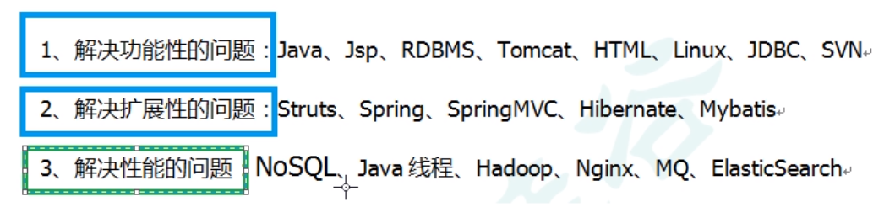
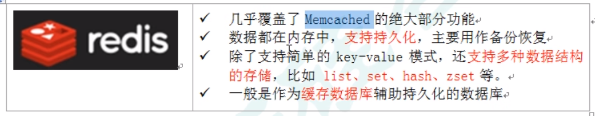
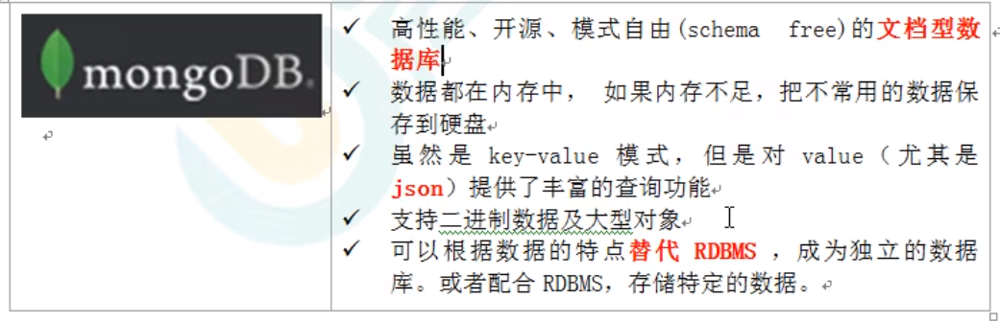
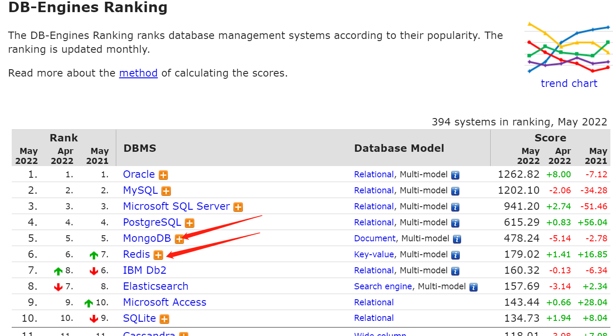
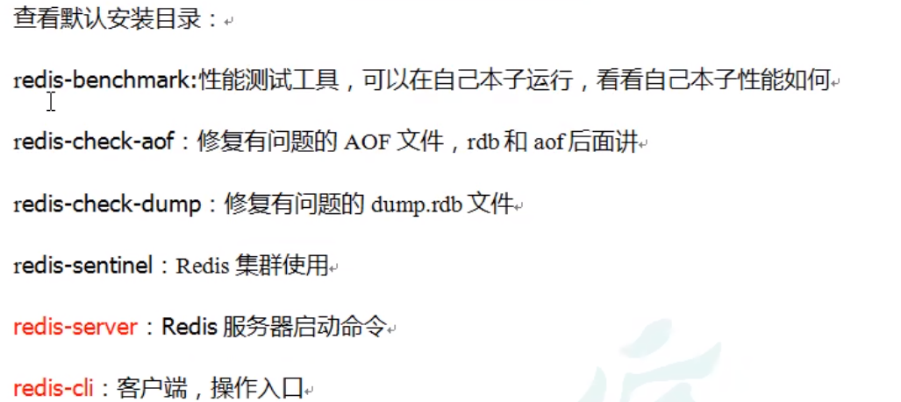

# Redis学习笔记

## 零. 前言

### 基于教程

[【尚硅谷】Redis 6 入门到精通 超详细 教程_哔哩哔哩_bilibili](https://www.bilibili.com/video/BV1Rv41177Af)（视频录制时间为2021年4月份）

### 官网

Redis官方网站：https://redis.io/

> 注意是`.io`不是`.com`哦，后者是Redis Cloud的官网。

Redis中文官方网站：http://redis.cn/

### 版本

* Redis For Linux 6.2.1
* CentOS 7.9

## 一. NoSQL数据库引入&简介

### 1.1 编程技术的分类



**Redis**就是一种典型的NoSQL数据库。

### 1.2 我们为什么需要NoSQL数据库

传统的网络应用：客户端 --> 单体的应用服务器（CPU和内存压力） --> 单体的数据库服务器（IO压力）

现在的网络应用：负载均衡器+**服务器集群**

此时如何解决**不同服务器之间的数据共享问题**？比如说如何共享同一用户的session？

* 方案1：将数据存储到客户端cookie中
  * 缺点：不安全
* 方案2：session复制
  * 缺点：session数据冗余。如果集群中有N个服务器，1份数据就要占用N份内存空间，服务器越多，空间浪费越大。
* 方案3：独立的文件服务器或数据库服务器
  * 缺点：IO效率是瓶颈

* 方案4：独立的NoSQL数据库服务器

  * 优点1：数据存放在内存中，不需要经过IO。起到类似缓存的作用，故又称“缓存数据库”。

  * 优点2：缓解原来应用服务器的CPU和内存压力。1份数据只需要占用1份内存空间
  * 优点3：缓解原来数据库服务器的IO压力。普通的数据库，即“SQL数据库”，做的是磁盘的读写操作，而NoSQL数据库的操作是内存级别的，不需要经过IO，速度极快。

[为什么要用Redis？Redis为什么这么快？ - 知乎](https://zhuanlan.zhihu.com/p/81195864)

> 一篇非常通俗易懂的文章，关于Redis入门你需要了解的所有东西，尽在此文，小白必读！

### 1.3 NoSQL数据库概述

NoSQL(non-relational / Not Only SQL )，意即"不仅仅是SQL"，泛指非关系型的数据库。

NoSQL的存储不依赖于业务逻辑，而是以简单的key-value模式存储。

* 不遵循SQL标准
* 不支持跨多个数据元素的ACID事务
* 提供远超于SQL的性能

适用场景：

* 数据的高并发读写
* 海量数据的读写
* 要求具备高可扩展性TODO

### 1.4 NoSQL数据库比较

#### Memcache


#### Redis



#### MongoDB



#### 数据库排行榜

来自网站：https://db-engines.com/en/ranking
根据流行度进行排名，每月实时更新。

> 截图中没有出现Memcache是因为此时它排在30名开外。



### 1.5 行式数据库与列式数据库

[一图理解行式数据库和列式数据库的区别 - 简书](https://www.jianshu.com/p/ad2533e5cfaa)

### 1.6 在Linux环境中安装Redis

#### 安装命令

下载redis-6.2.1.tar.gz放到/opt目录下，然后打开终端：

```shell
#
cd /opt
# 确认是否已经安装了gcc
gcc -version
# 安装gcc（GNU Compiler Collection，GNU编译器套件）
yum -y install gcc
# 检查gcc是否安装成功
gcc -version
# 解压
tar -zxvf redis-6.2.1.tar.gz
#
cd redis-6.2.1
# 编译
make
# 安装
make install
# 默认安装路径为/usr/local/bin
[root@hadoop100 bin]# cd /usr/local/bin
[root@hadoop100 bin]# ls
redis-benchmark  redis-check-rdb  redis-sentinel
redis-check-aof  redis-cli        redis-server
```

#### 安装目录

Redis安装目录下都有些什么？



### 1.7 启动Redis

#### 前台启动方式

```shell
redis-server
```

不推荐。独占一个Shell，无法运行别的命令（对于图形化界面，关闭终端窗口后Redis无法继续运行）

#### 后台启动方式

准备工作：

```shell
# 复制redis.conf
cp /opt/redis-6.2.1/redis.conf /etc/redis.conf
#
cd /etc
# 将配置文件中的daemonize no改为daemonize yes（守护线程）
vim redis.conf
```

启动：

```shell
redis-server /etc/redis.conf
```

进入redis命令行客户端程序：

```shell
redis-cli
```

### 1.8 关闭Redis

> 前提当然是以“后台启动方式”启动的

* 直接执行`redis-cli shutdown`

* 在Redis命令行中执行`shutdown`
* 先通过`ps -ef | grep redis`查看进程信息，再根据进程号直接杀死进程`kill 进程号`

