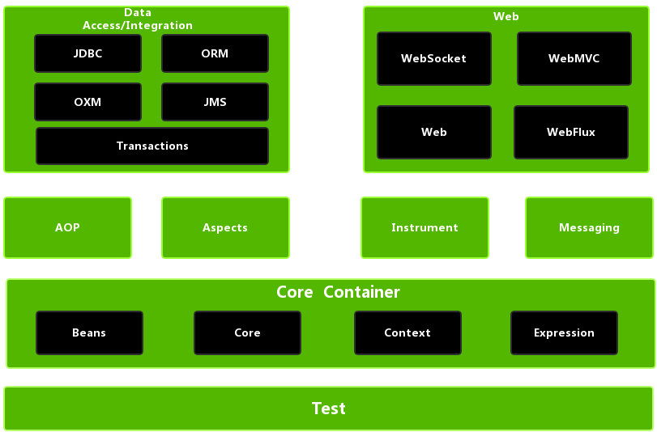

# Spring MVC学习笔记

## 零. 前言

### 0.1 基于教程TODO

[【狂神说Java】SpringMVC最新教程IDEA版通俗易懂_哔哩哔哩_bilibili](https://www.bilibili.com/video/BV1aE41167Tu?p=3)（发布时间：2019-10-20）

* [狂神说SpringMVC01：什么是SpringMVC](https://mp.weixin.qq.com/s/yuQqZzAsCefk9Jv_kbh_eA)
* 

《Java EE框架整合开发入门到实战》 - 清华大学出版社（出版时间：2018-09）

### 0.2 官方文档

[Web on Servlet Stack](https://docs.spring.io/spring-framework/docs/current/reference/html/web.html#spring-web)

### 0.3 参考资料

[Spring Framework 中文文档 - Web on Servlet 堆栈 | Docs4dev](https://www.docs4dev.com/docs/zh/spring-framework/5.1.3.RELEASE/reference/web.html)

[SpringMVC | broken's blog](https://guopeixiong.github.io/2021/10/30/SpringMVC/)（broken基于同一教程的学习笔记，值得参考）

### 0.4 本机环境版本TODO

* jdk 11
* tomcat 9
* 

## 一. 简介

### 1.1 学习方法

JavaSE：老师带，认真学，打好基础

Java Web：老师带，认真学，打好基础

SSM：看官方文档，锻炼自学能力、笔记能力、项目能力

### 1.2 回顾MVC架构

（这部分抄的课本的）

**MVC模式**

> MCV即Model、View和Controller，分别对应Web应用中的三种职责。
>
> * 模型：用于存储数据以及处理用户请求的业务逻辑。
> * 视图：向控制器提交数据，显示模型中的数据。
> * 控制器：根据视图提出的请求判断讲请求和数据交给哪个模型处理，将处理后的有关结果交给哪个视图更新显示。

**基于Java Bean+JSP+Servlet的MVC模式**

> 基于Servlet的MVC模式的具体实现如下：
>
> * 模型Model：一个或多个JavaBean对象，用于存储数据（实体模型，由JavaBean类创建）和处理业务逻辑（业务模型，由一般的Java类创建）
> * 视图View：一个或多个JSP页面，向控制器提交数据和为模型提供数据显示，JSP页面主要使用HTML标记和JavaBean标记来显示数据。
> * 控制器Controller：一个或多个Servlet对象，根据视图提交的请求进行控制，即将请求转发给处理业务逻辑的JavaBean，并将处理结果存放到实体模型JavaBean中

### 1.3 回顾Servlet

现在我们要用Servlet写一个非常简单的demo，让它跑起来。

#### 1.3.1 新建项目

在IDEA新建一个Maven项目`SpringMVC`，不使用模板。

新建子项目`springmvc-01-servlet`，同样不使用模板。

选中子项目根目录，右键Add Framework Support -> Web Application(4.0)。

现在还没有写任何代码，项目目录结构如图：


#### 1.3.2 导入javax-servlet-api依赖

```xml
<!-- https://mvnrepository.com/artifact/javax.servlet/javax.servlet-api -->
<dependency>
    <groupId>javax.servlet</groupId>
    <artifactId>javax.servlet-api</artifactId>
    <!--Maven依赖管理 | Maven教程网：此依赖范围，对于编译和测试有效，而对运行时无效。比如 servlet-api.jar 在 Tomcat 中已经提供了，我们只需要的是编译期提供而已。-->
    <version>4.0.1</version>
    <scope>provided</scope>
</dependency>
```

#### 1.3.3 创建test.jsp

在WEB-INF新建jsp目录，把jsp文件放在这个目录里。

为什么要放在WEB-INF里？因为放在**WEB-INF目录下的页面**如果不作配置一般是**无法直接通过网址访问**的。

因此我们可以利用这一点，把需要经过验证（比如登录验证）才能访问的页面，都放在这个“安全目录”里；而那些不需要经过任何验证就能访问的页面（比如欢迎页），就不放在这个目录里了。

```jsp
<%@ page contentType="text/html;charset=UTF-8" language="java" %>
<html>
<head>
    <title>Title</title>
    <meta charset="UTF-8">
</head>
<body>
    ${message}
</body>
</html>
```

#### 1.3.4 创建TestServlet.java

新建一个Servlet，Ctrl+O选择重写doPost和doGet方法。

```java
import javax.servlet.ServletException;
//import javax.servlet.annotation.WebServlet;
import javax.servlet.http.HttpServlet;
import javax.servlet.http.HttpServletRequest;
import javax.servlet.http.HttpServletResponse;
import java.io.IOException;

/**
 * @author Matty
 **/
//@WebServlet(name = "myServlet", value = "/TestServlet")
public class TestServlet extends HttpServlet {
    
    @Override
    protected void doGet(HttpServletRequest req, HttpServletResponse resp) throws ServletException, IOException {
        //1.获取前端参数
        String method = req.getParameter("method");
        if("add".equals(method)) {
            req.getSession().setAttribute("message", "执行了add方法");
        } else if("delete".equals(method)) {
            req.getSession().setAttribute("message", "执行了delete方法");
        } else {
            req.getSession().setAttribute("message", "方法名为空或方法名不存在");
        }
        //2.调用业务层
        //...
        //3.视图转发或重定向
        req.getRequestDispatcher("/WEB-INF/jsp/test.jsp").forward(req, resp);
    }
    
    @Override
    protected void doPost(HttpServletRequest req, HttpServletResponse resp) throws ServletException, IOException {
        doGet(req, resp);
    }
}
```

#### 1.3.5 配置web.xml

其效果等价于上面代码中注释掉的@WebServlet注解那一行。

```xml
<?xml version="1.0" encoding="UTF-8"?>
<web-app xmlns="http://xmlns.jcp.org/xml/ns/javaee"
         xmlns:xsi="http://www.w3.org/2001/XMLSchema-instance"
         xsi:schemaLocation="http://xmlns.jcp.org/xml/ns/javaee http://xmlns.jcp.org/xml/ns/javaee/web-app_4_0.xsd"
         version="4.0">
    <servlet>
        <servlet-name>myServlet</servlet-name>
        <servlet-class>TestServlet</servlet-class>
    </servlet>
    
    <servlet-mapping>
        <servlet-name>myServlet</servlet-name>
        <url-pattern>/TestServlet</url-pattern>
    </servlet-mapping>
</web-app>
```

#### 1.3.6 配置运行服务器


#### 1.3.7 访问页面

`http://localhost:8888/springmvc_01_servlet_war_exploded/`页面显示：`$END$`（Web项目默认的欢迎页面，即index.jsp）

`http://localhost:8888/springmvc_01_servlet_war_exploded/TestServlet`页面显示：方法名为空或方法名不存在

`http://localhost:8888/springmvc_01_servlet_war_exploded/TestServlet?method=add`页面显示：执行了add方法

`http://localhost:8888/springmvc_01_servlet_war_exploded/TestServlet?method=delete`页面显示：执行了delete方法

`http://localhost:8888/springmvc_01_servlet_war_exploded/TestServlet?method=adc`页面显示：方法名为空或方法名不存在

### 1.4 Spring MVC是什么

Spring MVC是Spring提供的一个实现了**Web MVC设计模式**的**轻量级Web框架**。

官方：

> Spring Web MVC is the <u>original web framework built on the Servlet API</u> and has <u>been included in the Spring Framework</u> from the very beginning. The <u>formal name, “Spring Web MVC”,</u> comes from the name of its source module ([`spring-webmvc`](https://github.com/spring-projects/spring-framework/tree/main/spring-webmvc)), but it is more commonly known as “Spring MVC”.

[SpringMVC 入门 - CoderJerry - 博客园](https://www.cnblogs.com/yangyuanhu/p/12271415.html)：

> ## 1.0 SpringMVC 框架概述
>
> Spring Web MVC是基于Servlet API构建的传统Web框架，并且从一开始就已包含在Spring框架中
>
> 与Spring Web MVC并行，Spring Framework 5.0引入了一个新的反应式Web框架，其名称“ Spring WebFlux;
>
> 理解:
>
> 首先SpringMVC 是一个MVC构架模式的web框架,是基于Servlet的,从Spring第一个版本就一起推出了,
>
> 传统web框架,指的是SpringMVC依然使用多线程同步并发的方式来处理请求,现如今大家都在鼓吹异步并发多么多么好,从测试数据来看异步并发效率的确更好,但是其并不成熟,极大多数公司项目还没有更新到异步技术,盲目的进行重构可能会引发更多的问题, 并且异步编程在代码结构上会产生较大的变化,对于初学者而言,掌握难度是较大的;
>
> 构架图:
> 
>
> ## 2.0 Spring-MVC在系统中的位置
>
> 
>
> 可以看出
>
> SpringMVC 并没有代替Servlet,它只是在Servlet上提供了一套封装好的组件,提高开发效率;
>
> 还使得开发出的项目更加规范;否则每个人可能有每个人不同的MVC;

### 1.5 为什么要学Spring MVC

> Spring MVC的特点：
>
> 1. 轻量级，简单易学
> 2. 高效 , 基于请求响应的MVC框架
> 3. 与Spring兼容性好，无缝结合
> 4. 约定优于配置
> 5. 功能强大：RESTful、数据验证、格式化、本地化、主题等
> 6. 简洁灵活

最重要的一点：**用的人多**，用的公司多，所以必须要会。

在SSM框架中，之前学的MyBatis和Spring还是比较推荐使用配置文件的，但是到了**Spring MVC**，建议**全部使用注解开发**，据说很香。

### 1.6 DispatcherServlet

官方：

> <u>Spring MVC, as many other web frameworks, is designed around the front controller pattern where a central `Servlet`, the `DispatcherServlet`, provides a shared algorithm for request processing, while actual work is performed by configurable delegate components.</u> This model is flexible and supports diverse workflows.
>
> The `DispatcherServlet`, as any `Servlet`, needs to be declared and mapped according to the Servlet specification by using Java configuration or in `web.xml`. In turn, the `DispatcherServlet` uses Spring configuration to discover the delegate components it needs for request mapping, view resolution, exception handling, [and more](https://docs.spring.io/spring-framework/docs/current/reference/html/web.html#mvc-servlet-special-bean-types).

DispatcherServlet本质上也是一个Servlet，

（导入相关依赖后，shift+shift+shift全局搜索DispatcherServlet，进入源码后ctrl+shift+alt+U查看类的UML图）


DispatcherServlet作为Spring MVC框架的中心Servlet，其主要作用是**将请求分派到不同的处理器**。


## 二. 依赖

```xml
<!-- 以下依赖均为当前最新版本（2022.04.05） -->
<dependencies>
    <!-- https://mvnrepository.com/artifact/junit/junit -->
    <dependency>
        <groupId>junit</groupId>
        <artifactId>junit</artifactId>
        <version>4.13.2</version>
        <scope>test</scope>
    </dependency>
    <!-- https://mvnrepository.com/artifact/org.springframework/spring-webmvc -->
    <dependency>
        <groupId>org.springframework</groupId>
        <artifactId>spring-webmvc</artifactId>
        <version>5.3.18</version>
    </dependency>
    <!-- https://mvnrepository.com/artifact/javax.servlet/javax.servlet-api -->
    <dependency>
        <groupId>javax.servlet</groupId>
        <artifactId>javax.servlet-api</artifactId>
        <!--Maven依赖管理 | Maven教程网：此依赖范围，对于编译和测试有效，而对运行时无效。比如 servlet-api.jar 在 Tomcat 中已经提供了，我们只需要的是编译期提供而已。-->
        <version>4.0.1</version>
        <scope>provided</scope>
    </dependency>
    <!-- https://mvnrepository.com/artifact/javax.servlet.jsp/javax.servlet.jsp-api -->
    <dependency>
        <groupId>javax.servlet.jsp</groupId>
        <artifactId>javax.servlet.jsp-api</artifactId>
        <version>2.3.3</version>
        <scope>provided</scope>
    </dependency>
</dependencies>
```


两个常见错误：400错误，要添加lib

500错误：怎么解决？