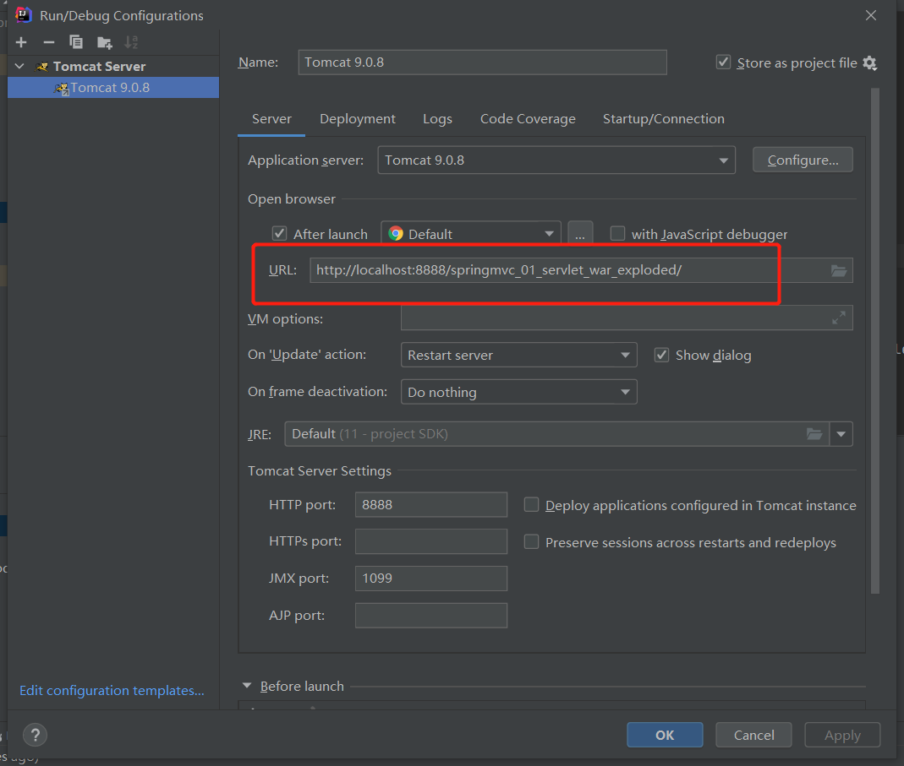

# Spring MVC学习笔记

## 零. 前言

### 0.1 基于教程

[【狂神说Java】SpringMVC最新教程IDEA版通俗易懂_哔哩哔哩_bilibili](https://www.bilibili.com/video/BV1aE41167Tu?p=3)（发布时间：2019-10-20）

* [狂神说SpringMVC01：什么是SpringMVC](https://mp.weixin.qq.com/s/yuQqZzAsCefk9Jv_kbh_eA)
* [狂神说SpringMVC02：第一个MVC程序](https://mp.weixin.qq.com/s/8ddT6FD0Y4f3XdbEz0aqpQ)
* [狂神说SpringMVC03：RestFul和控制器](https://mp.weixin.qq.com/s/3EtyzJohOVGz62nEYLhKHg)
* [狂神说SpringMVC04：数据处理及跳转](https://mp.weixin.qq.com/s/1d_PAk2IIp-WWX2eBbU3aw)
* [狂神说SpringMVC05：整合SSM框架](https://mp.weixin.qq.com/s/SDxqGu_il3MUCTcN1EYrng)
* [狂神说SpringMVC06：Json交互处理](https://mp.weixin.qq.com/s/RAqRKZJqsJ78HRrJg71R1g)
* [狂神说SpringMVC07：Ajax研究](https://mp.weixin.qq.com/s/tB4YX4H59wYS6rxaO3K2_g)
* [狂神说SpringMVC08：拦截器+文件上传下载](https://mp.weixin.qq.com/s/NWJoYiirbkSDz6x01Jji3g)

《Java EE框架整合开发入门到实战》 - 清华大学出版社（出版时间：2018-09）

### 0.2 官方文档

[Web on Servlet Stack](https://docs.spring.io/spring-framework/docs/current/reference/html/web.html#spring-web)

### 0.3 参考资料

[Spring Framework 中文文档 - Web on Servlet 堆栈 | Docs4dev](https://www.docs4dev.com/docs/zh/spring-framework/5.1.3.RELEASE/reference/web.html)

[SpringMVC | lxzforever](https://www.lxzforever.top/2021/10/30/SpringMVC/)（基于同一教程的学习笔记，值得参考）

### 0.4 本机环境

* **Spring Web MVC 5.3.18**
* JDK 11
* Tomcat 9

## 一. 简介

### 1.1 学习方法

JavaSE：老师带，认真学，打好基础

Java Web：老师带，认真学，打好基础

SSM：看官方文档，锻炼自学能力、笔记能力、项目能力

### 1.2 回顾MVC架构

（这部分抄的课本的）

**MVC模式**

> MCV即Model、View和Controller，分别对应Web应用中的三种职责。
>
> * 模型：用于存储数据以及处理用户请求的业务逻辑。
> * 视图：向控制器提交数据，显示模型中的数据。
> * 控制器：根据视图提出的请求判断讲请求和数据交给哪个模型处理，将处理后的有关结果交给哪个视图更新显示。

**基于Java Bean+JSP+Servlet的MVC模式**

> 基于Servlet的MVC模式的具体实现如下：
>
> * 模型Model：一个或多个JavaBean对象，用于存储数据（实体模型，由JavaBean类创建）和处理业务逻辑（业务模型，由一般的Java类创建）
> * 视图View：一个或多个JSP页面，向控制器提交数据和为模型提供数据显示，JSP页面主要使用HTML标记和JavaBean标记来显示数据。
> * 控制器Controller：一个或多个Servlet对象，根据视图提交的请求进行控制，即将请求转发给处理业务逻辑的JavaBean，并将处理结果存放到实体模型JavaBean中

### 1.3 回顾Servlet

现在我们要用Servlet写一个非常简单的demo，让它跑起来。

#### 1.3.1 新建项目`springmvc-01-servlet`

在IDEA新建一个Maven项目`SpringMVC`，不使用模板。

新建子项目`springmvc-01-servlet`，同样不使用模板。

选中子项目根目录，右键Add Framework Support -> Java EE -> Web Application(4.0)。

现在还没有写任何代码，项目目录结构如图：


#### 1.3.2 导入servlet依赖

```xml
<!-- 以下依赖均为当前最新版本（截止至2022.04.05） -->
<!-- https://mvnrepository.com/artifact/javax.servlet/javax.servlet-api -->
<dependency>
    <groupId>javax.servlet</groupId>
    <artifactId>javax.servlet-api</artifactId>
    <!--Maven依赖管理 | Maven教程网：此依赖范围，对于编译和测试有效，而对运行时无效。比如 servlet-api.jar 在 Tomcat 中已经提供了，我们只需要的是编译期提供而已。-->
    <version>4.0.1</version>
    <scope>provided</scope>
</dependency>
```

#### 1.3.3 创建jsp文件

在WEB-INF新建jsp目录，把jsp放在这个目录里。

为什么要放在WEB-INF里？因为放在**WEB-INF目录下的页面**如果不作配置一般是**无法直接通过网址访问**的。

因此我们可以利用这一点，把需要经过验证（比如登录验证）才能访问的页面，都放在这个“安全目录”里；而那些不需要经过任何验证就能访问的页面（比如欢迎页），就不放在这个目录里了。

test.jsp：

```jsp
<%@ page contentType="text/html;charset=UTF-8" language="java" %>
<html>
<head>
    <title>Title</title>
    <meta charset="UTF-8">
</head>
<body>
    ${message}
</body>
</html>
```

#### 1.3.4 创建Servlet

新建一个Servlet，Ctrl+O选择重写doPost和doGet方法。

TestServlet.java：

```java
import javax.servlet.ServletException;
//import javax.servlet.annotation.WebServlet;
import javax.servlet.http.HttpServlet;
import javax.servlet.http.HttpServletRequest;
import javax.servlet.http.HttpServletResponse;
import java.io.IOException;

/**
 * @author Matty
 **/
//@WebServlet(name = "myServlet", value = "/TestServlet")
public class TestServlet extends HttpServlet {
    
    @Override
    protected void doGet(HttpServletRequest req, HttpServletResponse resp) throws ServletException, IOException {
        //1.获取前端参数
        String method = req.getParameter("method");
        if("add".equals(method)) {
            req.getSession().setAttribute("message", "执行了add方法");
        } else if("delete".equals(method)) {
            req.getSession().setAttribute("message", "执行了delete方法");
        } else {
            req.getSession().setAttribute("message", "方法名为空或方法名不存在");
        }
        //2.调用业务层
        //...
        //3.视图转发或重定向
        req.getRequestDispatcher("/WEB-INF/jsp/test.jsp").forward(req, resp);
    }
    
    @Override
    protected void doPost(HttpServletRequest req, HttpServletResponse resp) throws ServletException, IOException {
        doGet(req, resp);
    }
}
```

#### 1.3.5 配置web.xml

其效果等价于上面代码中注释掉的@WebServlet注解那一行。

```xml
<?xml version="1.0" encoding="UTF-8"?>
<web-app xmlns="http://xmlns.jcp.org/xml/ns/javaee"
         xmlns:xsi="http://www.w3.org/2001/XMLSchema-instance"
         xsi:schemaLocation="http://xmlns.jcp.org/xml/ns/javaee http://xmlns.jcp.org/xml/ns/javaee/web-app_4_0.xsd"
         version="4.0">
    <servlet>
        <servlet-name>myServlet</servlet-name>
        <servlet-class>TestServlet</servlet-class>
    </servlet>
    
    <servlet-mapping>
        <servlet-name>myServlet</servlet-name>
        <url-pattern>/TestServlet</url-pattern>
    </servlet-mapping>
</web-app>
```

#### 1.3.6 配置运行服务器




#### 1.3.7 页面访问测试

`http://localhost:8888/springmvc_01_servlet_war_exploded/`页面显示：`$END$`（Web项目默认的欢迎页面，即index.jsp）

`http://localhost:8888/springmvc_01_servlet_war_exploded/TestServlet`页面显示：方法名为空或方法名不存在

`http://localhost:8888/springmvc_01_servlet_war_exploded/TestServlet?method=add`页面显示：执行了add方法

`http://localhost:8888/springmvc_01_servlet_war_exploded/TestServlet?method=delete`页面显示：执行了delete方法

`http://localhost:8888/springmvc_01_servlet_war_exploded/TestServlet?method=adc`页面显示：方法名为空或方法名不存在

### 1.4 Spring MVC是什么

Spring MVC是Spring提供的一个实现了**Web MVC设计模式**的**轻量级Web框架**。

官方：

> Spring Web MVC is the <u>original web framework built on the Servlet API</u> and has <u>been included in the Spring Framework</u> from the very beginning. The <u>formal name, “Spring Web MVC”,</u> comes from the name of its source module ([`spring-webmvc`](https://github.com/spring-projects/spring-framework/tree/main/spring-webmvc)), but it is more commonly known as “Spring MVC”.

[SpringMVC 入门 - CoderJerry - 博客园](https://www.cnblogs.com/yangyuanhu/p/12271415.html)：

> ## 1.0 SpringMVC 框架概述
>
> Spring Web MVC是基于Servlet API构建的传统Web框架，并且从一开始就已包含在Spring框架中
>
> 与Spring Web MVC并行，Spring Framework 5.0引入了一个新的反应式Web框架，其名称“ Spring WebFlux;
>
> 理解:
>
> 首先SpringMVC 是一个MVC构架模式的web框架,是基于Servlet的,从Spring第一个版本就一起推出了,
>
> 传统web框架,指的是SpringMVC依然使用多线程同步并发的方式来处理请求,现如今大家都在鼓吹异步并发多么多么好,从测试数据来看异步并发效率的确更好,但是其并不成熟,极大多数公司项目还没有更新到异步技术,盲目的进行重构可能会引发更多的问题, 并且异步编程在代码结构上会产生较大的变化,对于初学者而言,掌握难度是较大的;
>
> 构架图:
> 
>
> ## 2.0 Spring-MVC在系统中的位置
>
> 
>
> 可以看出
>
> SpringMVC 并没有代替Servlet,它只是在Servlet上提供了一套封装好的组件,提高开发效率;
>
> 还使得开发出的项目更加规范;否则每个人可能有每个人不同的MVC;

### 1.5 为什么要学Spring MVC

> Spring MVC的特点：
>
> 1. 轻量级，简单易学
> 2. 高效 , 基于请求响应的MVC框架
> 3. 与Spring兼容性好，无缝结合
> 4. 约定优于配置
> 5. 功能强大：RESTful、数据验证、格式化、本地化、主题等
> 6. 简洁灵活

最重要的一点：**用的人多**，用的公司多，所以必须要会。

在SSM框架中，之前学的MyBatis和Spring还是比较推荐使用配置文件的，但是到了**Spring MVC**，建议**全部使用注解开发**，据说很香。

### 1.6 DispatcherServlet

官方：

> <u>Spring MVC, as many other web frameworks, is designed around the front controller pattern where a central `Servlet`, the `DispatcherServlet`, provides a shared algorithm for request processing, while actual work is performed by configurable delegate components.</u> This model is flexible and supports diverse workflows.
>
> The `DispatcherServlet`, as any `Servlet`, needs to be declared and mapped according to the Servlet specification by using Java configuration or in `web.xml`. In turn, the `DispatcherServlet` uses Spring configuration to discover the delegate components it needs for request mapping, view resolution, exception handling, [and more](https://docs.spring.io/spring-framework/docs/current/reference/html/web.html#mvc-servlet-special-bean-types).

DispatcherServlet本质上也是一个Servlet，

（导入相关依赖后，shift+shift+shift全局搜索DispatcherServlet，进入源码后ctrl+shift+alt+U查看类的UML图）


Spring的web框架围绕DispatcherServlet（调度Servlet）设计，其主要作用是**将请求分发到不同的处理器**，即“将reuqest dispatch到不同的handler”。

接下来我们通过代码来理解Spring MVC的执行原理。

## 二. Hello SpringMVC

我们将用一些“笨方法”来写第一个Spring MVC程序，并通过它来帮助我们理解Spring MVC的执行流程和原理。

### 2.1 第一个Spring MVC程序

项目目录结构如图：


#### 2.1.1 新建项目`springmvc-02-hellomvc`

流程和1.3.1一样，只是项目名称不同。

#### 2.1.2 导入servlet和springmvc依赖

```xml
<dependencies>
    <!-- 以下依赖均为当前最新版本（截止至2022.04.05） -->
    <!-- https://mvnrepository.com/artifact/javax.servlet/javax.servlet-api -->
    <dependency>
        <groupId>javax.servlet</groupId>
        <artifactId>javax.servlet-api</artifactId>
        <!--Maven依赖管理 | Maven教程网：此依赖范围，对于编译和测试有效，而对运行时无效。比如 servlet-api.jar 在 Tomcat 中已经提供了，我们只需要的是编译期提供而已。-->
        <version>4.0.1</version>
        <scope>provided</scope>
    </dependency>
    <!-- https://mvnrepository.com/artifact/org.springframework/spring-webmvc -->
    <dependency>
        <groupId>org.springframework</groupId>
        <artifactId>spring-webmvc</artifactId>
        <version>5.3.18</version>
    </dependency>
</dependencies>
```


#### 2.1.3 编写springmvc配置文件

```xml
<?xml version="1.0" encoding="UTF-8"?>
<beans xmlns="http://www.springframework.org/schema/beans"
       xmlns:xsi="http://www.w3.org/2001/XMLSchema-instance"
       xsi:schemaLocation="http://www.springframework.org/schema/beans
       http://www.springframework.org/schema/beans/spring-beans.xsd">

	<!--（从 Spring4.0开始，如果不配置处理器映射器、处理器适配器和视图解析器，Spring会使用默认配置来完成相应工作。）-->
    
    <!-- 处理器映射器HandlerMapping，负责按照特定规则去查找Handler。 -->
    <!-- 只是为了理解原理才这么写，并非必要配置，注释掉也能正常运行。 -->
    <bean class="org.springframework.web.servlet.handler.BeanNameUrlHandlerMapping"/>

    <!-- 处理器适配器HandlerAdapter，负责按照特定规则去执行Handler。 -->
    <!-- 只是为了理解原理才这么写，并非必要配置，注释掉也能正常运行。 -->
    <bean class="org.springframework.web.servlet.mvc.SimpleControllerHandlerAdapter"/>

    <!-- 视图解析器ViewResolver，负责解析视图名 -->
    <bean class="org.springframework.web.servlet.view.InternalResourceViewResolver">
        <!-- 前缀 -->
        <property name="prefix" value="/WEB-INF/jsp/"/>
        <!-- 后缀 -->
        <property name="suffix" value=".jsp"/>
    </bean>

</beans>
```

#### 2.1.4 配置web.xml

```xml
<?xml version="1.0" encoding="UTF-8"?>
<web-app xmlns="http://xmlns.jcp.org/xml/ns/javaee"
         xmlns:xsi="http://www.w3.org/2001/XMLSchema-instance"
         xsi:schemaLocation="http://xmlns.jcp.org/xml/ns/javaee http://xmlns.jcp.org/xml/ns/javaee/web-app_4_0.xsd"
         version="4.0">

    <!-- 注册DispatcherServlet -->
    <servlet>
        <servlet-name>springmvc</servlet-name>
        <servlet-class>org.springframework.web.servlet.DispatcherServlet</servlet-class>
        <!-- 关联一个springmvc配置文件 -->
        <init-param>
            <param-name>contextConfigLocation</param-name>
            <!-- 命名规范：xxx-servlet.xml，其中xxx是servlet-name，在这里就是springmvc -->
            <param-value>classpath:springmvc-servlet.xml</param-value>
        </init-param>
        <!-- 启动级别设置为0或者大于0时，表示容器在应用启动时就加载这个servlet -->
        <load-on-startup>1</load-on-startup>
    </servlet>

    <servlet-mapping>
        <servlet-name>springmvc</servlet-name>
        <!-- url-pattern的匹配优先级是精确匹配（/login.html）、路径匹配（/*）、扩展名匹配（/*.html）、缺省匹配（/） -->
        <!-- 在这个例子中，虽然没有显示声明其他更高优先级的url匹配方式，但是由于servlet容器中有内置的“*.jsp”匹配器，而扩展名匹配的优先级高于缺省匹配，
        所以这里的“/”无法匹配带有.jsp后缀的请求，当然，除此之外的请求都可以。 -->
        <url-pattern>/</url-pattern>
    </servlet-mapping>

</web-app>
```

##### 关于\<load-on-startup\>

[servlet配置load-on-startup的作用_xuke6677的博客-CSDN博客_loadonstartup servlet](https://blog.csdn.net/xuke6677/article/details/44752207)

> 在servlet的配置当中，\<load-on-startup\>1\</load-on-startup\>的含义是：
>
> 标记容器是否在启动的时候就加载这个servlet。
>
> 当值为0或者大于0时，表示容器在应用启动时就加载这个servlet；
>
> 当是一个负数时或者没有指定时，则指示容器在该servlet被选择时才加载。
>
> 正数的值越小，启动该servlet的优先级越高。
>
>   如果我们在web.xml中设置了多个servlet的时候，可以使用load-on-startup来指定servlet的加载顺序，服务器会根据load-on-startup的大小依次对servlet进行初始化。不过即使我们将load-on-startup设置重复也不会出现异常，服务器会自己决定初始化顺序。
>
> 配置load-on-startup后，servlet在startup后立即加载，但只是调用servlet的init()方法，用以初始化该servlet相关的资源。初始化成功后，该servlet可响应web请求；如未配置load-on-startup，容器一般在第一次响应web请求时，会先检测该servlet是否初始化，如未初始化，则调用servlet的init()先初始化，初始化成功后，再响应请求。
> PS：一般我们在开发web应用时，都会配置这个参数，有两个好处：1、如果初始化过程失败，则容器会提示启动失败，此时我们能够提前知道相关错误；2、配置该参数相当于将初始化servlet的工作转移到容器启动过程，使得容器只要启动成功后，就可立即响应web请求。

##### 关于\<url-pattern\>

[servlet的url-pattern匹配规则 - canger - 博客园](https://www.cnblogs.com/canger/p/6084846.html)

> 首先需要明确几容易混淆的规则：
>
> 1. servlet容器中的匹配规则既不是简单的通配，也不是正则表达式，而是特定的规则。所以不要用通配符或者正则表达式的匹配规则来看待servlet的url-pattern。
> 2. Servlet 2.5开始，一个servlet可以使用多个url-pattern规则，\<servlet-mapping\>标签声明了与该servlet相应的匹配规则，每个\<url-pattern\>标签代表1个匹配规则；
> 3. 当servlet容器接收到浏览器发起的一个url请求后，容器会用url减去当前应用的上下文路径，以剩余的字符串作为servlet映射，假如url是`http://localhost:8080/appDemo/index.html`，其应用上下文是appDemo，容器会将`http://localhost:8080/appDemo`去掉，用剩下的`/index.html`部分拿来做servlet的映射匹配
> 4. url-pattern映射匹配过程是有优先顺序的
> 5. 而且当有一个servlet匹配成功以后，就不会去理会剩下的servlet了。
>
> ...
>
> ## 二、匹配顺序
>
> 1. 精确匹配，servlet-mapping1：\<url-pattern\>/user/users.html\</url-pattern\>，servlet-mapping2：\<url-pattern\>/*\</url-pattern\>。当一个请求`http://localhost:8080/appDemo/user/users.html`来的时候，servlet-mapping1匹配到，不再用servlet-mapping2匹配
> 2. 路径匹配，先最长路径匹配，再最短路径匹配servlet-mapping1：\<url-pattern\>/user/\*</url-pattern\>，servlet-mapping2：\<url-pattern\>/*\</url-pattern\>。当一个请求`http://localhost:8080/appDemo/user/users.html`来的时候，servlet-mapping1匹配到，不再用servlet-mapping2匹配
> 3. 扩展名匹配，servlet-mapping1：\<url-pattern\>/user/\*</url-pattern\>，servlet-mapping2：\<url-pattern\>*.action\</url-pattern\>。当一个请求`http://localhost:8080/appDemo/user/addUser.action`来的时候，servlet-mapping1匹配到，不再用servlet-mapping2匹配
> 4. 缺省匹配，以上都找不到servlet，就用默认的servlet，配置为\<url-pattern\>/\</url-pattern\>
>
> ...

#### 2.1.5 编写处理器

在这种情况下，可以认为**HelloController类**既是**处理器handler**，又是**控制器controller**，也是**servlet**，这三个概念只是从不同角度描述了同一件事物。

```java
import org.springframework.web.servlet.ModelAndView;
import org.springframework.web.servlet.mvc.Controller;

import javax.servlet.http.HttpServletRequest;
import javax.servlet.http.HttpServletResponse;

/**
 * Base Controller interface, 
 * representing a component that receives HttpServletRequest and HttpServletResponse instances 
 * just like a HttpServlet but is able to participate in an MVC workflow.
 */
public class HelloController implements Controller {
    
    @Override
    public ModelAndView handleRequest(HttpServletRequest request, HttpServletResponse response) throws Exception {
        ModelAndView modelAndView = new ModelAndView();
        
        // 业务代码
        String result = "Hello SpringMVC!";
        modelAndView.addObject("result", result);
        // 设置视图名称
        modelAndView.setViewName("hello");
        
        return modelAndView;
    }
    
}
```

在前面的springmvc配置文件中注册bean class，并设置bean id为它要处理的请求。

```xml
<!-- 处理器Handler。该处理器是一个Controller，本质上是一个Servlet。 -->
<bean id="/hello" class="HelloController"/>
```

#### 2.1.6 配置运行服务器

同1.3.6，注意把部署到服务器的Artifact改为当前项目的Artifact。

#### 2.1.7 页面访问测试

`http://localhost:8888/springmvc_02_hellomvc_war_exploded/`页面显示：`$END$`（Web项目默认的欢迎页面，即index.jsp）

`http://localhost:8888/springmvc_02_hellomvc_war_exploded/hello`页面显示：Hello SpringMVC!

#### 2.1.8 错误排查

##### 可能的报错1

**报错：**

访问`/hello`发生404错误。

**排错分析：**

查看Tomcat Localhost Log，发现报错`java.lang.ClassNotFoundException: org.springframework.web.servlet.DispatcherServlet`

Ctrl+Shift+Alt+S唤出Project Structure窗口，查看Project Settings->Artifacts->springmvc-02-hellomvc:war exploded（取决于当前项目）->Output Layout->Output Root，发现缺失springmvc相关的jar包。

注意servlet相关的jar包其实Tomcat容器里是自带了的，我们将其导入Maven项目只是为了方便编译、测试。

但是springmvc相关的jar包，Tomcat容器里是没有的，所以我们需要导出相关jar包到Artifact中，这样在运行期才能用到它们。

**解决方案：**


##### 可能的报错2

具体是访问`/`还是`/hello`，报404还是500什么的我忘了（好像是访问`/hello`报500），但是我记得出错原因是什么。

就是我的项目没有输出target目录，Artifact里的WEB-INF/classes里也没有.class文件，换言之我写的java代码没有被编译。

记录一下可能的出错原因，以后遇到类似的错误可以多留一个心眼。（完整的解决过程我记不太清，就不写了）

##### Web项目debug心得

出现报错时，要**耐心读报错信息**，包括页面上的报错和服务器日志。

对于简单的入门级别的错误，是很容易通过这个途径发现的。

### 2.2 Spring MVC执行原理

先看狂神文章的这张图，非常值得参考。


但是狂神本人的进一步讲解，不管是文字还是视频，一些表达逻辑和用词都不够清晰，太过模棱两可，听完感觉自己似乎大概懂了，但又经不起问。

所以这里的原理讲解要参考下面这位大佬的博客，看完豁然开朗。

[SpringMVC 工作原理详解 - Y.yang - 博客园](https://www.cnblogs.com/yoci/p/10642493.html#:~:text=MVC%20%E7%9A%84%E5%8E%9F%E7%90%86%E5%9B%BE%E5%A6%82%E4%B8%8B%EF%BC%9A%20SpringMVC%20%E6%A1%86%E6%9E%B6%E6%98%AF%E4%BB%A5%E8%AF%B7%E6%B1%82%E4%B8%BA%E9%A9%B1%E5%8A%A8%EF%BC%8C%E5%9B%B4%E7%BB%95,Servlet%20%E8%AE%BE%E8%AE%A1%EF%BC%8C%E5%B0%86%E8%AF%B7%E6%B1%82%E5%8F%91%E7%BB%99%E6%8E%A7%E5%88%B6%E5%99%A8%EF%BC%8C%E7%84%B6%E5%90%8E%E9%80%9A%E8%BF%87%E6%A8%A1%E5%9E%8B%E5%AF%B9%E8%B1%A1%EF%BC%8C%E5%88%86%E6%B4%BE%E5%99%A8%E6%9D%A5%E5%B1%95%E7%A4%BA%E8%AF%B7%E6%B1%82%E7%BB%93%E6%9E%9C%E8%A7%86%E5%9B%BE%E3%80%82%20%E5%85%B6%E4%B8%AD%E6%A0%B8%E5%BF%83%E7%B1%BB%E6%98%AF%20DispatcherServlet%EF%BC%8C%E5%AE%83%E6%98%AF%E4%B8%80%E4%B8%AA%20Servlet%EF%BC%8C%E9%A1%B6%E5%B1%82%E6%98%AF%E5%AE%9E%E7%8E%B0%E7%9A%84Servlet%E6%8E%A5%E5%8F%A3%E3%80%82)

> # 先来看一下什么是 MVC 模式
>
> MVC 是一种设计模式.
>
> MVC 的原理图如下：
>
> 
>
> ...
>
> # SpringMVC 工作原理（重要）
>
> **简单来说：**
>
> 客户端发送请求-> 前端控制器 DispatcherServlet 接受客户端请求 -> 找到处理器映射 HandlerMapping 解析请求对应的 Handler-> HandlerAdapter 会根据 Handler 来调用真正的处理器开处理请求，并处理相应的业务逻辑 -> 处理器返回一个模型视图 ModelAndView -> 视图解析器进行解析 -> 返回一个视图对象->前端控制器 DispatcherServlet 渲染数据（Moder）->将得到视图对象返回给用户
>
> 
>
> **流程说明（重要）：**
>
> （1）客户端（浏览器）发送请求，直接请求到 DispatcherServlet。
>
> （2）DispatcherServlet 根据请求信息调用 HandlerMapping，解析请求对应的 Handler。
>
> （3）解析到对应的 Handler（也就是我们平常说的 Controller 控制器）后，开始由 HandlerAdapter 适配器处理。
>
> （4）HandlerAdapter 会根据 Handler 来调用真正的处理器开处理请求，并处理相应的业务逻辑。
>
> （5）处理器处理完业务后，会返回一个 ModelAndView 对象，Model 是返回的数据对象，View 是个逻辑上的 View。
>
> （6）ViewResolver 会根据逻辑 View 查找实际的 View。
>
> （7）DispaterServlet 把返回的 Model 传给 View（视图渲染）。
>
> （8）把 View 返回给请求者（浏览器）
>
> # SpringMVC 重要组件说明
>
> **1、前端控制器DispatcherServlet（不需要工程师开发）,由框架提供（重要）**
>
> 作用：**Spring MVC 的入口函数。接收请求，响应结果，相当于转发器，中央处理器。有了 DispatcherServlet 减少了其它组件之间的耦合度。用户请求到达前端控制器，它就相当于mvc模式中的c，DispatcherServlet是整个流程控制的中心，由它调用其它组件处理用户的请求，DispatcherServlet的存在降低了组件之间的耦合性。**
>
> **2、处理器映射器HandlerMapping(不需要工程师开发),由框架提供**
>
> 作用：根据请求的url查找Handler。HandlerMapping负责根据用户请求找到Handler即处理器（Controller），SpringMVC提供了不同的映射器实现不同的映射方式，例如：配置文件方式，实现接口方式，注解方式等。
>
> **3、处理器适配器HandlerAdapter**
>
> 作用：按照特定规则（HandlerAdapter要求的规则）去执行Handler 通过HandlerAdapter对处理器进行执行，这是适配器模式的应用，通过扩展适配器可以对更多类型的处理器进行执行。
>
> **4、处理器Handler(需要工程师开发)**
>
> 注意：编写Handler时按照HandlerAdapter的要求去做，这样适配器才可以去正确执行Handler Handler 是继DispatcherServlet前端控制器的后端控制器，在DispatcherServlet的控制下Handler对具体的用户请求进行处理。 由于Handler涉及到具体的用户业务请求，所以一般情况需要工程师根据业务需求开发Handler。
>
> **5、视图解析器View resolver(不需要工程师开发),由框架提供**
>
> 作用：进行视图解析，根据逻辑视图名解析成真正的视图（view） View Resolver负责将处理结果生成View视图，View Resolver首先根据逻辑视图名解析成物理视图名即具体的页面地址，再生成View视图对象，最后对View进行渲染将处理结果通过页面展示给用户。 springmvc框架提供了很多的View视图类型，包括：jstlView、freemarkerView、pdfView等。 一般情况下需要通过页面标签或页面模版技术将模型数据通过页面展示给用户，需要由工程师根据业务需求开发具体的页面。
>
> **6、视图View(需要工程师开发)**
>
> View是一个接口，实现类支持不同的View类型（jsp、freemarker、pdf...）
>
> ...

## 三. 使用注解开发SpringMVC

### 3.1 修改项目`springmvc-02-hellomvc`

直接在2.1的`springmvc-02-hellomvc`项目的基础上改动即可。

**再写一个Controller**（注意包路径）：

```java
package com.example.controller;

import org.springframework.stereotype.Controller;
import org.springframework.ui.Model;
import org.springframework.web.bind.annotation.RequestMapping;

@Controller
@RequestMapping("/hello")
public class HelloControllerTwo {
    
    @RequestMapping("/two")
    public String sayHello(Model model) {
        String result = "Hello SpringMVC!";
        model.addAttribute("result", result);
        return "hello";
    }
}

```

**改一下springmvc配置文件**：

```xml
<?xml version="1.0" encoding="UTF-8"?>
<beans xmlns="http://www.springframework.org/schema/beans"
       xmlns:xsi="http://www.w3.org/2001/XMLSchema-instance"
       xmlns:context="http://www.springframework.org/schema/context"
       xmlns:mvc="http://www.springframework.org/schema/mvc"
       xsi:schemaLocation="http://www.springframework.org/schema/beans
       http://www.springframework.org/schema/beans/spring-beans.xsd
       http://www.springframework.org/schema/context
       https://www.springframework.org/schema/context/spring-context.xsd
       http://www.springframework.org/schema/mvc
       https://www.springframework.org/schema/mvc/spring-mvc.xsd">

    <!--（从 Spring4.0开始，如果不配置处理器映射器、处理器适配器和视图解析器，Spring会使用默认配置来完成相应工作。）-->

    <!-- 处理器映射器HandlerMapping，负责按照特定规则去查找Handler。 -->
    <!-- 只是为了理解原理才这么写，并非必要配置，注释掉也能正常运行。 -->
<!--    <bean class="org.springframework.web.servlet.handler.BeanNameUrlHandlerMapping"/>-->

    <!-- 处理器适配器HandlerAdapter，负责按照特定规则去执行Handler。 -->
    <!-- 只是为了理解原理才这么写，并非必要配置，注释掉也能正常运行。 -->
<!--    <bean class="org.springframework.web.servlet.mvc.SimpleControllerHandlerAdapter"/>-->

    <!-- 处理器Handler。该处理器是一个Controller，本质上是一个Servlet。 -->
    <bean id="/hello" class="HelloController"/>

    <!-- 视图解析器ViewResolver，负责解析视图名 -->
    <bean class="org.springframework.web.servlet.view.InternalResourceViewResolver">
        <!-- 前缀 -->
        <property name="prefix" value="/WEB-INF/jsp/"/>
        <!-- 后缀 -->
        <property name="suffix" value=".jsp"/>
    </bean>


    <!-- 自动扫描指定包中的java文件，若扫描到被@Component、@Controller等注解标记的类，就将其注册为Bean，由Spring容器统一管理。 -->
    <!--（因为是指定“某个”包，不是指定“某些”包，所以base-package的值没有"*"这种写法，更不能为""。）-->
    <context:component-scan base-package="com.example.controller"/>

    <!-- 使用Web容器默认的Servlet来处理对静态资源的请求，用于解决【静态资源访问】的问题 -->
    <!-- 但是说实话我没有成功解决过这个问题，所以这里也算是一个TODO吧 -->
    <mvc:default-servlet-handler/>

    <!-- 支持SpringMVC注解驱动 -->
    <!-- 狂神：在spring中一般采用@RequestMapping注解来完成映射关系，
    要想使@RequestMapping注解生效，必须向上下文中注册DefaultAnnotationHandlerMapping和一个AnnotationMethodHandlerAdapter实例，
    这两个实例分别在类级别和方法级别处理，而annotation-driven配置帮助我们自动完成上述两个实例的注入。 -->
    <!--（经实测，其实注释掉这行也不影响程序运行，可能是SpringMVC默认帮我们配置好了。）-->
    <mvc:annotation-driven/>

</beans>
```

> 关于【静态资源访问】的问题：[SPRING-MVC访问静态文件,如jpg,js,css - LuisZach's Blog - ITeye博客](https://www.iteye.com/blog/lzy83925-1186609)

**重新发布运行**：

访问`http://localhost:8888/springmvc_02_hellomvc_war_exploded/hello/two`页面显示：Hello SpringMVC!

### 3.2 符合RESTful规范的URL

#### 3.2.1 扩展阅读

这几篇博客质量都很高，非常值得一读：

[RESTful到底是什么？ - 张瑞丰 - 博客园](https://www.cnblogs.com/zhangruifeng/p/13257731.html)

[RESTful API 最佳实践 - 阮一峰的网络日志](https://www.ruanyifeng.com/blog/2018/10/restful-api-best-practices.html)

[理解RESTful架构 - 阮一峰的网络日志](https://www.ruanyifeng.com/blog/2011/09/restful.html)

> 由于此时我的学习主线是Spring MVC，就不花过多时间去了解RESTful架构了，只需要知道在Spring MVC中怎么实现就好。

#### 3.2.2 实现

* 在com.example.controller包下**新建RESTfulController**.java

```java
package com.example.controller;

import org.springframework.stereotype.Controller;
import org.springframework.ui.Model;
import org.springframework.web.bind.annotation.*;

@Controller
public class RESTfulController {
    
    /**
     * 无风格：/item?a=1&b=2
     */
    @RequestMapping("/item")
    public String getAPlusB1(int a, int b, Model model) {
        model.addAttribute("result", a + b);
        return "hello";
    }
    
    /**
     * RESTful风格：/item/1/2
     */
    @RequestMapping("/item/{a}/{b}")
    public String getAPlusB2(@PathVariable int a, @PathVariable int b, Model model) {
        model.addAttribute("result", a + b);
        return "hello";
    }
    
    /**
     * （在下面这两个方法中，我已经尽量使各种命名都符合RESTful规范，但这个规范不是重点，重点是在SpringMVC中如何用@RequestMapping注解实现它。）
     * GET /article/{articleId}
     */
    @RequestMapping(path = "/article/{articleId}", method = RequestMethod.GET)
//    @GetMapping("/article/{articleId}")
    public String getArticle(@PathVariable int articleId, Model model) {
        model.addAttribute("articleId", articleId);
        return "articleSelected";
    }
    
    /**
     * POST /article/{articleId}
     */
    @RequestMapping(path = "/article/{articleId}", method = RequestMethod.POST)
//    @PostMapping("/article/{articleId}")
    public String addArticle(@PathVariable int articleId, Model model) {
        model.addAttribute("articleId", articleId);
        return "articlePosted";
    }
    
    //此时如果用除了get和post方法之外的其他请求方法访问URL"/article"，会报405错误（注意不是404也不是500）
}
```

* 在WEB-INF/jsp目录下**创建articleSelected.jsp**

```jsp
<%@ page contentType="text/html;charset=UTF-8" language="java" %>
<html>
<head>
    <title>Title</title>
    <meta charset="UTF-8">
</head>
<body>
    查到一篇文章：${articleId}
</body>
</html>
```

* 在WEB-INF/jsp目录下**创建articlePosted.jsp**

```jsp
<%@ page contentType="text/html;charset=UTF-8" language="java" %>
<html>
<head>
    <title>Title</title>
    <meta charset="UTF-8">
</head>
<body>
    发布新文章：${articleId}
</body>
</html>
```

* 测试

  * 访问`http://localhost:8888/springmvc_02_hellomvc_war_exploded/item?a=1&b=2`，显示`3`
  * 访问`http://localhost:8888/springmvc_02_hellomvc_war_exploded/item/1/2`，显示`3`
  * 以**GET**方式访问`http://localhost:8888/springmvc_02_hellomvc_war_exploded/article/123`，显示`123`
  * 以**POST**方式访问`http://localhost:8888/springmvc_02_hellomvc_war_exploded/article/123`，应该会显示`123`（我懒得写个form表单去测试post请求方法了）

  

### 3.3 @RequestMapping

```java
/**
 * Annotation for mapping web requests onto methods in request-handling classes
 * with flexible method signatures.
 *
 * ...
 *
 * <p><strong>Note:</strong> This annotation can be used both at the class and
 * at the method level. In most cases, at the method level applications will
 * prefer to use one of the HTTP method specific variants
 * {@link GetMapping @GetMapping}, {@link PostMapping @PostMapping},
 * {@link PutMapping @PutMapping}, {@link DeleteMapping @DeleteMapping}, or
 * {@link PatchMapping @PatchMapping}.</p>
 * 
 * ...
 */
@Target({ElementType.TYPE, ElementType.METHOD})
@Retention(RetentionPolicy.RUNTIME)
@Documented
@Mapping
public @interface RequestMapping {
    
    @AliasFor("path")
	String[] value() default {};
    
    @AliasFor("value")
	String[] path() default {};
    
    RequestMethod[] method() default {};
    
    ...
}
```

**总结一下**：

可以使用@RequestMapping注解，将Web请求（web requests）映射到请求处理器的方法（methods in request-handling classes）上。

注意@RequestMapping注解可以用在类（ElementType.TYPE）上和方法（ElementType.METHOD）上。当@RequestMapping用在方法上时，通常会使用其衍生注解（@GetMapping, @PostMapping, @PutMapping, @DeleteMapping, or @PatchMapping.）来指定一个HTTP请求类型（HTTP method）。

> 我们随意看一个@PostMapping，
>
> ```java
> /**
>  * Annotation for mapping HTTP {@code POST} requests onto specific handler
>  * methods.
>  */
> @Target(ElementType.METHOD)
> @Retention(RetentionPolicy.RUNTIME)
> @Documented
> @RequestMapping(method = RequestMethod.POST)
> public @interface PostMapping {
>     ...
> }
> ```
>
> 很明显是“继承”自@RequestMapping，但@PostMapping只能用在方法上，并且已经指定了method = RequestMethod.POST。

## 四. 重定向与转发

转发（forward）发生在服务端，故客户端浏览器地址栏不变；

重定向（redirect）发生在客户端，故客户端浏览器地址栏会改变。

> 注意：
>
> 在Spring MVC中实现重定向和转发的方式有很多，这一章只是尽可能把它们全都罗列出来，但最常用的只是前两种而已。

### 4.1 Spring MVC方式

#### 4.1.1 ViewResolver + return ModelAndView

在2.1访问`/hello`，最终访问到WEB-INF/jsp/hello.jsp，用的就是这种方式。我直接复制一部分关键代码过来：

* HelloController.java

```java
@Override
public ModelAndView handleRequest(HttpServletRequest request, HttpServletResponse response) throws Exception {
    ModelAndView modelAndView = new ModelAndView();
    String result = "Hello SpringMVC!";
    modelAndView.addObject("result", result);
    modelAndView.setViewName("hello");
    // 转发
    return modelAndView;
}
```
* springmvc-servlet.xml

```xml
<bean class="org.springframework.web.servlet.view.InternalResourceViewResolver">
    <property name="prefix" value="/WEB-INF/jsp/"/>
    <property name="suffix" value=".jsp"/>
</bean>
```

#### 4.1.2 ViewResolver + return String

在2.1访问`/hello/two`，最终访问到WEB-INF/jsp/hello.jsp，用的就是这种方式。同样复制一部分关键代码：

* HelloController**Two**.java

```java
@Controller
@RequestMapping("/hello")
public class HelloControllerTwo {
    
    @RequestMapping("/two")
    public String sayHello(Model model) {
        String result = "Hello SpringMVC!";
        model.addAttribute("result", result);
        return "hello";
    }
}
```

* springmvc-servlet.xml

```xml
<bean class="org.springframework.web.servlet.view.InternalResourceViewResolver">
    <property name="prefix" value="/WEB-INF/jsp/"/>
    <property name="suffix" value=".jsp"/>
</bean>
```

#### 4.1.3 return String

* 新建一个**TestHelloController**.java（注意我们要访问的是**/index.jsp**，因为/WEB-INF/jsp/hello.jsp无法直接通过URL访问）

```java
package com.example.controller;

import org.springframework.stereotype.Controller;
import org.springframework.ui.Model;
import org.springframework.web.bind.annotation.RequestMapping;

/**
 * 测试Spring MVC中不使用视图解析器的转发和重定向
 */
@Controller
public class TestController {
    
    @RequestMapping("/forward1")
    public String testForward1(Model model) {
        String result = "通过转发，访问/index.jsp，地址栏无变化";
        model.addAttribute("message", result);
        // 这种写法只有当ViewResolver不存在时才生效
        return "/index.jsp";
    }
    
    @RequestMapping("/forward2")
    public String testForward2(Model model) {
        String result = "通过转发，访问/index.jsp，地址栏无变化";
        model.addAttribute("message", result);
        // 这种写法可以无视ViewResolver
        return "forward:/index.jsp";
    }
    
    @RequestMapping("/redirect")
    public String testRedirect(Model model) {
        String result = "（可以无视ViewResolver）通过重定向，访问/index.jsp，地址有变化！";
        model.addAttribute("message", result);
        // 这种写法可以无视ViewResolver
        return "redirect:/index.jsp";
    }
}
```

* springmvc-servlet.xml

```xml
<!--    <bean class="org.springframework.web.servlet.view.InternalResourceViewResolver">-->
<!--        <property name="prefix" value="/WEB-INF/jsp/"/>-->
<!--        <property name="suffix" value=".jsp"/>-->
<!--    </bean>-->
```

### 4.2 Servlet原生API方式

在1.3的纯Servlet项目中访问`/TestServlet`，最终访问到WEB-INF/jsp/test.jsp，用的就是这种方式。同样复制一部分关键代码：

* **TestServlet**.java

```java
//@WebServlet(name = "myServlet", value = "/TestServlet")
public class TestServlet extends HttpServlet {
    
    @Override
    protected void doGet(HttpServletRequest req, HttpServletResponse resp) throws ServletException, IOException {
        // ...
        // 转发
        req.getRequestDispatcher("/WEB-INF/jsp/test.jsp").forward(req, resp);
    }
    
}
```

```java
// 重定向
resp.sendRirect("/index");
```

## 五. 获取前端数据

获取前端数据即**接收请求参数**。这部分内容其实在前面的代码中都或多或少涉及到了，这里我们简单做一下总结。

扩展阅读：[Java 后端接收Request请求参数的7种方式_ShiuHB的博客-CSDN博客_java接收参数方式](https://blog.csdn.net/ShiuHB/article/details/109674343)

**要获得URL`/test?id=5`中携带的参数，总共有如下方法：**

至于RESTful风格的参数如何处理，前面3.2刚写，这里就不赘述了。

### 5.1 方式一：使用Servlet API

使用最原始的Servlet API，

```java
@Override
protected void doGet(HttpServletRequest req, HttpServletResponse resp) throws ServletException, IOException {
    // ...
	req.getAttribute("id");
    // ...
}
```

实际应用：1.3.4的TestServlet类中的doGet方法。

### 5.2 方式二：直接通过方法同名参数获取

当URL参数与处理器方法的参数名相同，可以直接通过方法参数获取。

```java
@RequestMapping("/test") 
public String testMethod(String id){ 
    ...
}
```

实际应用：3.2.2的RESTfulController类中的getAPlusB1方法。

### 5.3 方式三：使用@RequestParam注解

当URL参数与处理器方法的参数名不同，可以使用@RequestParam注解。

（Spring MVC的这个@RequestParam注解真的和[MyBatis中的@Param注解](https://wuhang.xyz/c460cf59.html#8-2-使用注解完成CURD)有异曲同工之妙啊）

> 建议无论参数名是否相同，都使用@RequestParam注解，可以提高代码的可读性，让人一看就知道这个参数接收的是请求参数（所谓request parameter）。

```java
@RequestMapping("/test") 
public String testMethod(@RequestParam("id") String xxx){ 
    ...
}
```

实际应用：见5.4。

### 5.4 方式四：使用实体类接受URL参数

若URL请求中的参数名与实体中的属性名一致，即可自动映射到实体属性中。

**假设URL为`/test?id=1&name=wuhang&age=18`。**

（这种方式和[在MyBatis中取出Mapper方法的参数对象的对应属性值](https://wuhang.xyz/c460cf59.html#insert)也是具有异曲同工之妙啊）

```java
@RequestMapping("/test") 
public String testMethod(User user){ 
    ...
}
```

```java
public class User {
    String id;
    String name;
    int age;
    
    // getter、setter、全参构造
}
```

实际应用：

* 在com.example.controller包下**新建ParamTestController**.java

```java
package com.example.controller;

import org.springframework.stereotype.Controller;
import org.springframework.web.bind.annotation.RequestMapping;
import org.springframework.web.bind.annotation.RequestParam;

@Controller
public class ParamTestController {
    
    @RequestMapping("/test1")
    public String testMethod1(@RequestParam("id") String userId){
        System.out.println("id=" + userId);
        return "forward:/index.jsp";
    }
    
    @RequestMapping("/test2")
    public String testMethod2(User user){
        System.out.println(user);
        return "forward:/index.jsp";
    }
    
}

class User {
    
    String id;
    String name;
    int age;
    
    //必须要有setter才能获取同名URL参数 !!!
    public void setId(String id) {
        this.id = id;
    }
    
    public void setName(String name) {
        this.name = name;
    }
    
    public void setAge(int age) {
        this.age = age;
    }
    
    @Override
    public String toString() {
        return "User{" +
                "id='" + id + '\'' +
                ", name='" + name + '\'' +
                ", age=" + age +
                '}';
    }
}
```

* 测试

  * 访问`http://localhost:8888/springmvc_02_hellomvc_war_exploded/test1?id=001`，控制台打印出`id=001`

  * 访问`http://localhost:8888/springmvc_02_hellomvc_war_exploded/test1?id=1&name=wuhang&age=18`，控制台打印出`User{id='1', name='wuhang', age=18}`

## 六. 将数据返回给前端

### 6.1 方式一：通过ModelAndView

家喻户晓，老少咸宜。

实际应用：参照2.1.5。

### 6.2 方式二：通过Model

家喻户晓，老少咸宜。

实际应用：参照3.1。

### 6.3 方式三：通过ModelMap

不常用。

> 就对于新手而言简单来说使用区别就是：
>
> Model 只有寥寥几个方法只适合用于储存数据，简化了新手对于Model对象的操作和理解；
>
> ModelMap 继承了 LinkedMap ，除了实现了自身的一些方法，同样的继承 LinkedMap 的方法和特性；
>
> ModelAndView 可以在储存数据的同时，可以进行设置返回的逻辑视图，进行控制展示层的跳转。

## 七. 解决乱码问题

以前在写Servlet的时候，乱码问题通常通过手写并配置过滤器来解决。

现在我们可以直接使用Spring MVC为我们提供的过滤器，原理是一样的，但是再也不用自己写了。

```xml
<filter>
   <filter-name>encoding</filter-name>
   <filter-class>org.springframework.web.filter.CharacterEncodingFilter</filter-class>
   <init-param>
       <param-name>encoding</param-name>
       <param-value>utf-8</param-value>
   </init-param>
</filter>
<filter-mapping>
   <filter-name>encoding</filter-name>
   <!-- 注意/和/*的区别，前者不会匹配*.jsp -->
   <url-pattern>/*</url-pattern>
</filter-mapping>
```

如果还是解决不了，可以使用大佬（先人）写的功能更为强大的过滤器，并把它配置到web.xml中。

> 下面这个代码是狂神提供的，但并不是他的原创。

```java
import javax.servlet.*;
import javax.servlet.http.HttpServletRequest;
import javax.servlet.http.HttpServletRequestWrapper;
import javax.servlet.http.HttpServletResponse;
import java.io.IOException;
import java.io.UnsupportedEncodingException;
import java.util.Map;

/**
* 解决get和post请求 全部乱码的过滤器
*/
public class GenericEncodingFilter implements Filter {

   @Override
   public void destroy() {
  }

   @Override
   public void doFilter(ServletRequest request, ServletResponse response, FilterChain chain) throws IOException, ServletException {
       //处理response的字符编码
       HttpServletResponse myResponse=(HttpServletResponse) response;
       myResponse.setContentType("text/html;charset=UTF-8");

       // 转型为与协议相关对象
       HttpServletRequest httpServletRequest = (HttpServletRequest) request;
       // 对request包装增强
       HttpServletRequest myrequest = new MyRequest(httpServletRequest);
       chain.doFilter(myrequest, response);
  }

   @Override
   public void init(FilterConfig filterConfig) throws ServletException {
  }

}

//自定义request对象，HttpServletRequest的包装类
class MyRequest extends HttpServletRequestWrapper {

   private HttpServletRequest request;
   //是否编码的标记
   private boolean hasEncode;
   //定义一个可以传入HttpServletRequest对象的构造函数，以便对其进行装饰
   public MyRequest(HttpServletRequest request) {
       super(request);// super必须写
       this.request = request;
  }

   // 对需要增强方法 进行覆盖
   @Override
   public Map getParameterMap() {
       // 先获得请求方式
       String method = request.getMethod();
       if (method.equalsIgnoreCase("post")) {
           // post请求
           try {
               // 处理post乱码
               request.setCharacterEncoding("utf-8");
               return request.getParameterMap();
          } catch (UnsupportedEncodingException e) {
               e.printStackTrace();
          }
      } else if (method.equalsIgnoreCase("get")) {
           // get请求
           Map<String, String[]> parameterMap = request.getParameterMap();
           if (!hasEncode) { // 确保get手动编码逻辑只运行一次
               for (String parameterName : parameterMap.keySet()) {
                   String[] values = parameterMap.get(parameterName);
                   if (values != null) {
                       for (int i = 0; i < values.length; i++) {
                           try {
                               // 处理get乱码
                               values[i] = new String(values[i]
                                      .getBytes("ISO-8859-1"), "utf-8");
                          } catch (UnsupportedEncodingException e) {
                               e.printStackTrace();
                          }
                      }
                  }
              }
               hasEncode = true;
          }
           return parameterMap;
      }
       return super.getParameterMap();
  }

   //取一个值
   @Override
   public String getParameter(String name) {
       Map<String, String[]> parameterMap = getParameterMap();
       String[] values = parameterMap.get(name);
       if (values == null) {
           return null;
      }
       return values[0]; // 取回参数的第一个值
  }

   //取所有值
   @Override
   public String[] getParameterValues(String name) {
       Map<String, String[]> parameterMap = getParameterMap();
       String[] values = parameterMap.get(name);
       return values;
  }
}
```

## 八. JSON