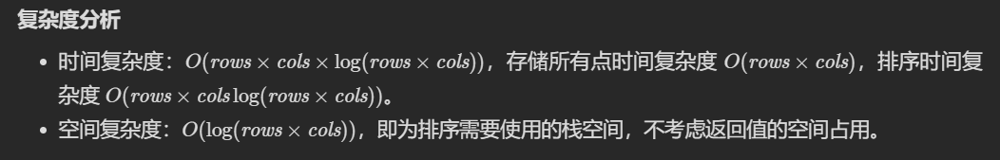

1403题题解发布：

[【Java】为什么要先排序然后倒序遍历？思路详解+一步步优化 - 非递增顺序的最小子序列 - 力扣（LeetCode）](https://leetcode.cn/problems/minimum-subsequence-in-non-increasing-order/solution/by-matty12138-iorg/)

1460题评论发布（回复别人的评论）：

https://leetcode.cn/problems/make-two-arrays-equal-by-reversing-sub-arrays/comments/1653893

https://leetcode.cn/problems/make-two-arrays-equal-by-reversing-sub-arrays/comments/1653903

# 排序-第一轮 刷题笔记

## 关于*号和&号

题号前面带\*表示自己没有AC，是看题解才AC的。

题号前面带\&表示还有明显更高效的解法（这道题还没有吃透），但是我没有去研究，待以后重做的时候再看。

## [747. 至少是其他数字两倍的最大数](https://leetcode.cn/problems/largest-number-at-least-twice-of-others/)

给你一个整数数组 nums ，其中总是存在 唯一的 一个最大整数 。

请你找出数组中的最大元素并检查它是否 至少是数组中每个其他数字的两倍 。如果是，则返回 最大元素的下标 ，否则返回 -1 。

> 示例 1：
>
> 输入：nums = [3,6,1,0]
> 输出：1
> 解释：6 是最大的整数，对于数组中的其他整数，6 至少是数组中其他元素的两倍。6 的下标是 1 ，所以返回 1 。
> 示例 2：
>
> 输入：nums = [1,2,3,4]
> 输出：-1
> 解释：4 没有超过 3 的两倍大，所以返回 -1 。
> 示例 3：
>
> 输入：nums = [1]
> 输出：0
> 解释：因为不存在其他数字，所以认为现有数字 1 至少是其他数字的两倍。
>
>
> 提示：
>
> 1 <= nums.length <= 50
> 0 <= nums[i] <= 100
> nums 中的最大元素是唯一的

#### 分析

只要最大元素大于或等于第二大元素的两倍，就能够满足题目所说的“最大元素至少是数组中每个其他数字的两倍”。

#### 解法一：数组映射+排序API  O(N*log(N))  O(1)  21%  78%  1ms  39.2MB

特殊情况：数组长度为1，直接返回0；

除了特殊情况，我的第一反应是，ArrayList.sort排序一下，比较最大值和第二大值，但是这样就丢失了最大值原来的下标。既然是要记住原来下标，而nums数组的长度和元素大小又都很小，那就可以用“数组映射”（本人自己发明的词儿）——这其实是数组映射的经典应用场景——将nums里的元素值映射到该元素在排序前所在下标（nums数组长度1\~50，故arrayMap选用byte型；元素大小0\~100，故arrayMap长度选择101）。

#### 解法二：只找最大和第二大  O(1N)  O(1)  100%  37%  1ms  39.5MB

釜底抽薪！我们需要的其实只有这三个数据：

* 唯一的最大元素
* 唯一的最大元素的下标
* 第二大元素，不一定唯一，但是无需记住下标

那就维护三个变量，遍历一遍数组后排好“前二排行榜”，最后比较一下即可。

这种解法就简单多了，也快很多。时间复杂度马上就降了下来，只是花在一次遍历上。

## [905. 按奇偶排序数组](https://leetcode.cn/problems/sort-array-by-parity/)

给你一个整数数组 `nums`，将 `nums` 中的的所有偶数元素移动到数组的前面，后跟所有奇数元素。

返回满足此条件的 **任一数组** 作为答案。

> 示例 1：
>
> 输入：nums = [3,1,2,4]
> 输出：[2,4,3,1]
> 解释：[4,2,3,1]、[2,4,1,3] 和 [4,2,1,3] 也会被视作正确答案。
> 示例 2：
>
> 输入：nums = [0]
> 输出：[0]
>
>
> 提示：
>
> 1 <= nums.length <= 5000
> 0 <= nums[i] <= 5000

#### 分析

数组的左边本来就已经有一些偶数元素了，数组的右边也本来就有一些奇数元素了，我们要做的只是把部分“不合群”的元素挑出来放到另一边去。

#### 解法：双指针  O(1N)  O(1)  100%  82%  0ms  42MB

从前找奇数，从后找偶数，然后互换位置，保证下标0\~i都是偶数，下标j~nums.length\-1都是奇数。

```java
class Solution {
    public int[] sortArrayByParity(int[] nums) {
        // 双指针
        int i = 0;
        int j = nums.length - 1;
        // 从前找奇数，从后找偶数，然后互换位置，保证下标0~i都是偶数，下标j~nums.length-1都是奇数
        while(i < j) {

            while(i < j && nums[i] % 2 != 1) {
                i++;
            }
            // 退出上面的循环时，要么i==j（到达边界，不需要交换位置），要么nums[i]是奇数（需要交换位置）

            while(i < j && nums[j] % 2 != 0) {
                j--;
            }
            // 退出上面的循环时，要么i==j（到达边界，不需要交换位置），要么nums[j]是偶数（需要交换位置）

            //如果未到达边界，则交换位置
            if(i < j) {
                int numJ = nums[j];
                nums[j] = nums[i];
                nums[i] = numJ;
                i++;
                j--;
            }
        }
        return nums;
    }
}
```

## [922. 按奇偶排序数组 II](https://leetcode.cn/problems/sort-array-by-parity-ii/)

给定一个非负整数数组 `nums`， `nums` 中一半整数是 **奇数** ，一半整数是 **偶数** 。

对数组进行排序，以便当 `nums[i]` 为奇数时，`i` 也是 **奇数** ；当 `nums[i]` 为偶数时， `i` 也是 **偶数** 。

你可以返回 *任何满足上述条件的数组作为答案* 。

> 示例 1：
>
> 输入：nums = [4,2,5,7]
> 输出：[4,5,2,7]
> 解释：[4,7,2,5]，[2,5,4,7]，[2,7,4,5] 也会被接受。
> 示例 2：
>
> 输入：nums = [2,3]
> 输出：[2,3]
>
>
> 提示：
>
> 2 <= nums.length <= 2 * 10^4
> nums.length 是偶数
> nums 中一半是偶数
> 0 <= nums[i] <= 1000

#### 分析

根据题意可得数组长度为偶数，并且当所有偶数都“就位”，即位于偶数下标时，所有奇数也是“就位”的。

和905题类似，我们只需要用双指针把”不合群“的元素挑出来然后互换位置即可。

既然要看合不合“群”，那么如果划分两个“群”呢？最简单的方式是以偶数下标和奇数下标为区分，这样也方便分开遍历。

#### 解法：双指针  O(1N)  O(1)  96%  14%  2ms  44.2MB

使用双指针，在一个大while循环中，小while遍历偶数下标i，找到值为奇数的元素，再小while遍历奇数下标j，找到值为偶数的元素，然后两个元素值互换即可。

```java
class Solution {
    public int[] sortArrayByParityII(int[] nums) {
        // 双指针
        int i = 0;
        int j = 1;

        int len = nums.length;
        while(i < len && j < len) {
            // 遍历偶数下标i，找到值为奇数的元素
            while(i < len && nums[i] % 2 == 0) {
                // 该下标符合条件（偶下标偶值），放过，继续循环
                i += 2;
            }
            // 要么该下标不符合条件（偶下标奇值），要么下标已越界并且所有元素已符合条件（偶下标偶值，奇下标奇值），退出循环

            // 再遍历奇数下标j，找到值为偶数的元素
            while(j < len && nums[j] % 2 == 1) {
                // 该下标符合条件（奇下标奇值），放过，继续循环
                j += 2;
            }
            // 要么该下标不符合条件（奇下标偶值），要么下标已越界并且所有元素已符合条件（偶下标偶值，奇下标奇值），退出循环

            // 若下标未越界，则两者的值互换
            if(i < len) {
                int numsJ = nums[j];
                nums[j] = nums[i];
                nums[i] = numsJ;
                i += 2;
                j += 2;
            }
        }
        return nums;
    }
}
```

2022.07.05


## [937. 重新排列日志文件](https://leetcode.cn/problems/reorder-data-in-log-files/)

给你一个日志数组 logs。每条日志都是以空格分隔的字串，其第一个字为字母与数字混合的 标识符 。

有两种不同类型的日志：

* 字母日志：除标识符之外，所有字均由小写字母组成
* 数字日志：除标识符之外，所有字均由数字组成

请按下述规则将日志重新排序：

* 所有 字母日志 都排在 数字日志 之前。

* 字母日志 在内容不同时，忽略标识符后，按内容字母顺序排序；在内容相同时，按标识符排序。
* 数字日志 应该保留原来的相对顺序。

返回日志的最终顺序。

> 示例 1：
>
> 输入：logs = ["dig1 8 1 5 1","let1 art can","dig2 3 6","let2 own kit dig","let3 art zero"]
> 输出：["let1 art can","let3 art zero","let2 own kit dig","dig1 8 1 5 1","dig2 3 6"]
> 解释：
> 字母日志的内容都不同，所以顺序为 "art can", "art zero", "own kit dig" 。
> 数字日志保留原来的相对顺序 "dig1 8 1 5 1", "dig2 3 6" 。
> 示例 2：
>
> 输入：logs = ["a1 9 2 3 1","g1 act car","zo4 4 7","ab1 off key dog","a8 act zoo"]
> 输出：["g1 act car","a8 act zoo","ab1 off key dog","a1 9 2 3 1","zo4 4 7"]
>
>
> 提示：
>
> 1 <= logs.length <= 100
> 3 <= logs[i].length <= 100
> logs[i] 中，字与字之间都用 单个 空格分隔
> 题目数据保证 logs[i] 都有一个标识符，并且在标识符之后至少存在一个字

#### 分析

首先我们需要实现稳定排序，这样的话才能保证数字日志之间的相对顺序不变；

其次我们需要自定义排序，这样才能给字母日志排序，因为比较两个字符日志时的情况比较多，要分割，分割完还要分情况比较。

#### 解法一：Arrays.sort  暴力  O(N*log(N))  O(1)  7%  23%  9ms  41.9MB

注意Arrays的sort方法在排对象时是稳定的，比如`sort(T[] a, Comparator<? super T> c)`；只有在排基本数据类型时才是不稳定排序，比如`sort(int[] a)`。

自定义排序，Lambda表达式实现Comparator接口。

另外还要写一个封装方法来判断日志类型。

* 当两个比较元素中只有一个是数字日志时，把数字日志向后排（判为更大）
* 当两个比较元素都是数字日志时，两者的相对顺序不变（判为相等）
* 当两个比较元素都是字母日志时，使用split(" ", 2)将日志分割成“标识符”和“内容”两个部分
  * 若内容不同则比较内容
  * 若内容相同则比较标识符

#### 解法一小优化：O(N*log(N))  O(1)  4ms  42MB  64%  10%

优化1：split方法增加limit参数，即`String[] split(String regex, int limit)`，既省去多余的分隔符匹配运算，也方便后续的比较。

优化2：直接根据每条日志的最后一个字符是不是数字来判断日志类型，不需要分割，因为数字日志的内容部分全都由数字组成。

2022.07.06


## \*[976. 三角形的最大周长](https://leetcode.cn/problems/largest-perimeter-triangle/)

给定由一些正数（代表长度）组成的数组 `nums` ，返回 *由其中三个长度组成的、**面积不为零**的三角形的最大周长* 。如果不能形成任何面积不为零的三角形，返回 `0`。

> 示例 1：
>
> 输入：nums = [2,1,2]
> 输出：5
> 示例 2：
>
> 输入：nums = [1,2,1]
> 输出：0
>
>
> 提示：
>
> 3 <= nums.length <= 10^4
> 1 <= nums[i] <= 10^6

#### 分析

三条边构成三角形的必要充分条件：**任意两边和大于第三边**

最暴力的算法当然是三层for，一次试一条边，这样时间复杂度是O(N^3)，肯定会超时。但是除此之外我完全没思路了，只好看官方题解。他是**基于最长边**来试的，而且只判断**相邻三边中的较小两边是否大于最长边**。

引用[蓝田](https://leetcode.cn/u/lan-tian-38/)在官方题解评论区的评论：

> **为什么只需要判断 a + b > c ?**
>
> 正常情况下，对于三条边长，判断能否组成三角形需要判断任何两条边长相加都大于其余的一条边长，即：
>
> ```swift
> a + b > c && a + c > b && b + c > a
> ```
>
> 而如果已知 a<=b<=c，那么必然有：
>
> 1. a + c > b，因为 c >= b，那c加上一个正数一定就比b大了。而题目里说所数都>=1，所以c加上a一定比b大。
> 2. b + c > a，因为b和c至少跟a一样大(b>=a, c>=a)，加起来的结果至少有2a，即 b+c >= 2a > a
>
> 所以最终只需要判断 a + b > c 即可。
>
> **为什么只需要判断数组中相邻的三个数？**
>
> 在固定最后一个数 A[i] 时，前两个数需不需要再往前找呢？
>
> 如果 A[i-2] + A[i-1] <= A[i] ，这三个数一定不能构成三角形，而A[i-3]以及更往前的数，都小于等于A[i-2]，所以再往前取任何两个数只会让相加的值更小，就更不能满足 A[j] + A[k] > A[i]了 (j<i-2, k<i-1, j<k)。所以如果相邻的数构不成三角形，就不需要再固定第三个数并往前找两个数了。
>
> 如果 A[i-2] + A[i-1] > A[i]j，这三个数可以构成三角形，再往前找只会让周长变短，所以也不用再往前了。
>
> 综上，只需要判断相邻的三个数。

#### 官方解法：排序+贪心  O(N*log(N))  Ω(logN)  99%  60%  8ms  41.6MB

> 官方给的这个空间复杂度我不是很理解……评论区也有人问，不过暂时没人回答这个问题。

```java
class Solution {
    public int largestPerimeter(int[] nums) {
        Arrays.sort(nums);
        for(int i = nums.length - 1; i >= 2; i--) {
            if(nums[i - 2] + nums[i - 1] > nums[i]) {
               return nums[i - 2] + nums[i - 1] + nums[i];
            }
        }
        return 0;
    }
}
```

## [977. 有序数组的平方](https://leetcode.cn/problems/squares-of-a-sorted-array/)

给你一个按 **非递减顺序** 排序的整数数组 `nums`，返回 **每个数字的平方** 组成的新数组，要求也按 **非递减顺序** 排序。

> 示例 1：
>
> 输入：nums = [-4,-1,0,3,10]
> 输出：[0,1,9,16,100]
> 解释：平方后，数组变为 [16,1,0,9,100]
> 排序后，数组变为 [0,1,9,16,100]
> 示例 2：
>
> 输入：nums = [-7,-3,2,3,11]
> 输出：[4,9,9,49,121]
>
>
> 提示：
>
> 1 <= nums.length <= 10^4
> -10^4 <= nums[i] <= 10^4
> nums 已按 非递减顺序 排序
>
> **进阶：**
>
> - 请你设计时间复杂度为 `O(n)` 的算法解决本问题

#### 分析

暴力解很简单，直接平方完排序一下结果就出来了，但是时间复杂度达不到O(N)。

我们可以利用题目“nums 已按 非递减顺序 排序”的条件，通过两个指针从数组的左右两边来遍历它，因为绝对值最大的数肯定在原数组的最左边或者最右边，在每一轮遍历中，我们都选择那个最大的，然后放到刚声明的新数组的最右边去，然后收缩两个指针的范围，再次寻找绝对值最大的数。

#### 解法一：纯暴力解  32%  28%  O(N*log(N))  O(log(N))  4ms  43.3MB

> 复杂度分析
>
> 时间复杂度：O(n \log n)O(nlogn)，其中 nn 是数组 \textit{nums}nums 的长度。
>
> 空间复杂度：O(\log n)O(logn)。除了存储答案的数组以外，我们需要 O(\log n)O(logn) 的栈空间进行排序。

用for循环遍历一次变成平方，再用Arrays.sort排序一次即可。

但是这样没有利用到”已按 非递减顺序 排序“这个条件，因此达不到时间复杂度的进阶要求。

#### 解法二：双指针收缩遍历+链表存储  O(N)  O(N)  33%  18%  3ms  43.4MB

*和解法二优化的思路完全一致，只是用LinkedList存储，插入用addFirst方法，最后还要用迭代器将链表中所有元素依次取出放回原数组并返回原数组的引用。*

#### 解法二优化：双指针收缩遍历+普通数组存储  O(N)  O(N)  100%  18%  1ms  43.3MB

既然链表做的永远都是头插入这一种操作，而且最后还要转换成int数组，那还不如我一开始就声明一个int数组，反正数组长度是固定的，只要声明一个尾指针，从后（length-1）往前（0）插入即可。

```java
class Solution {
    public int[] sortedSquares(int[] nums) {
        // 要想时间O(N)那就不可能用常规的排序算法了。通常可以结合题目已有条件用双指针达到O(N)时间。
        int i = 0;
        int j = nums.length - 1;
        // 要根据绝对值把负数穿插到正数旁边的话，肯定要用到O(N)额外空间的，除非在原地排序，但我们现在要的是O(N)时间的算法。
        int[] newNums = new int[nums.length];
        int tail = newNums.length - 1;

        // 左右两边都可能是绝对值最大的数，所以边收缩边遍历
        while(nums[i] < 0 && i < j) {
            if(nums[j] > - nums[i]) {
                newNums[tail--] = nums[j] * nums[j];
                j--;
            }
            else if(nums[j] < - nums[i]) {
                newNums[tail--] = nums[i] * nums[i];
                i++;
            }
            else {
                newNums[tail--] = nums[j] * nums[j];
                j--;
                newNums[tail--] = nums[i] * nums[i];
                i++;
            }
        }
        // 退出循环有三种情况：
        // 一种是nums[i] >= 0，
        if(nums[i] >= 0) {
            // 此时nums[i~j]都是未被加入newNums的非负整数
            while(i <= j) {
                newNums[tail--] = nums[j] * nums[j];
                j--;
            }
        }
        // 第二种情况是i==j，
        else if(i == j) {
            // 此时只有nums[i或j]未被加入newNums
            newNums[tail--] = nums[i] * nums[i];
        }
        // 第三种情况是i=j+1时（当最大负数和最小非负整数的绝对值相等时就会出现这种特殊情况），
        // 此时所有元素均已被加入newNums，无需其他操作

        return newNums;
    }
}
```

2022.07.07


## [1005. K 次取反后最大化的数组和](https://leetcode.cn/problems/maximize-sum-of-array-after-k-negations/)

给你一个整数数组 nums 和一个整数 k ，按以下方法修改该数组：

选择某个下标 i 并将 nums[i] 替换为 -nums[i] 。
重复这个过程恰好 k 次。可以多次选择同一个下标 i 。

以这种方式修改数组后，返回数组 可能的最大和 。

> 示例 1：
>
> 输入：nums = [4,2,3], k = 1
> 输出：5
> 解释：选择下标 1 ，nums 变为 [4,-2,3] 。
> 示例 2：
>
> 输入：nums = [3,-1,0,2], k = 3
> 输出：6
> 解释：选择下标 (1, 2, 2) ，nums 变为 [3,1,0,2] 。
> 示例 3：
>
> 输入：nums = [2,-3,-1,5,-4], k = 2
> 输出：13
> 解释：选择下标 (1, 4) ，nums 变为 [2,3,-1,5,4] 。
>
>
> 提示：
>
> 1 <= nums.length <= 10^4
> -100 <= nums[i] <= 100
> 1 <= k <= 10^4

#### 分析

先排序，然后尽量把所有负数取反，并且优先把取反的机会用在绝对值更大的负数上。

如果取反次数不够用，那当然只能这样了，没什么好说的。

如果所有负数取反后（此时整个数组的元素都是非负整数），取反次数还有剩，那就看是剩奇数个还是偶数个（k为偶数的话可以对同一个元素重复取反而结果不变），如果是剩奇数次取反，那就只能把其中一次用在目前绝对值最小的那个非负整数上。

#### 解法：排序后尽量对负数取反  O(N)  O(log(N))  97%  67%  2ms  40.8MB

```java
class Solution {
    public int largestSumAfterKNegations(int[] nums, int k) {
        // 按升序排序
        Arrays.sort(nums);
        int i = 0;
        // 从左往右/从小到大/从绝对值大到绝对值小，尽可能把所有负数都取反
        while(k > 0 && i < nums.length) {
            // 对负数取反
            if(nums[i] <= 0) {
                nums[i] = -nums[i];
                i++;
                k--;
            }
            // 此时数组中已经没有负数了，如果取反次数k是偶数，那刚好啥都不用管。
            else if(k % 2 == 0) {
                return getSum(nums);
            }
            // 此时数组中已经没有负数了，但取反次数k是奇数，那只能用掉1次取反了，显然我们要找到此时的最小非负整数并对其取反，这样影响最小。
            // 若i==0，也就是说这个数组原本就没有负数，那么最小的数肯定是nums[i]；
            // 否则就要比较nums[i]（原来的最小非负整数）和nums[i-1]（原来的最小绝对值负数，此时已取反，为正数）。
            else if(i == 0 || nums[i] < nums[i - 1]) {
                nums[i] = -nums[i];
                return getSum(nums);
            }
            // nums[i] >= nums[i - 1]
            else {
                nums[i - 1] = -nums[i - 1];
                return getSum(nums);
            }
        }
        // 退出循环有两种情况，取反次数k用完了，或者数组遍历完了（说明这个数组原本就全是负数）。
        // 如果是前者那自然不用管，如果是后者那就还得考虑一下是剩余奇数次还是偶数次，剩奇数次的话，就要找nums[i-1]也就是nums[nums.length - 1]（原来的最小绝对值负数，此时已取反，为正数），对它取反，影响最小。
        if(k > 0 && k % 2 != 0) {
            nums[i - 1] = -nums[i - 1];
        }
        return getSum(nums);
    }

    // 封装一个求数组所有元素总和的方法
    public int getSum(int[] arr) {
        int sum = 0;
        for(int i = 0; i < arr.length; i++) {
            sum += arr[i];
        }
        return sum;
    }
}
```

#### 贪心思想

来自评论区：https://leetcode.cn/problems/maximize-sum-of-array-after-k-negations/comments/1011830

> \## 思路
>
> 本题思路其实比较好想了，如何可以让数组和最大呢？
>
> 贪心的思路，局部最优：让绝对值大的负数变为正数，当前数值达到最大，整体最优：整个数组和达到最大。
>
> 局部最优可以推出全局最优。
>
> 那么如果将负数都转变为正数了，K依然大于0，此时的问题是一个有序正整数序列，如何转变K次正负，让 数组和 达到最大。
>
> 那么又是一个贪心：局部最优：只找数值最小的正整数进行反转，当前数值可以达到最大（例如正整数数组{5, 3, 1}，反转1 得到-1 比 反转5得到的-5 大多了），全局最优：整个 数组和 达到最大。
>
> 虽然这道题目大家做的时候，可能都不会去想什么贪心算法，一鼓作气，就AC了。
>
> **我这里其实是为了给大家展现出来 经常被大家忽略的贪心思路，这么一道简单题，就用了两次贪心！**
>
> 那么本题的解题步骤为：
>
> - 第一步：将数组按照绝对值大小从大到小排序，**注意要按照绝对值的大小**
> - 第二步：从前向后遍历，遇到负数将其变为正数，同时K--
> - 第三步：如果K还大于0，那么反复转变数值最小的元素，将K用完
> - 第四步：求和
>
> 对应C++代码如下：
>
> ```c++
> class Solution {
> static bool cmp(int a, int b) {
>     return abs(a) > abs(b);
> }
> public:
>     int largestSumAfterKNegations(vector<int>& A, int K) {
>         sort(A.begin(), A.end(), cmp);       // 第一步
>         for (int i = 0; i < A.size(); i++) { // 第二步
>             if (A[i] < 0 && K > 0) {
>                 A[i] *= -1;
>                 K--;
>             }
>         }
>         if (K % 2 == 1) A[A.size() - 1] *= -1; // 第三步
>         int result = 0;
>         for (int a : A) result += a;        // 第四步
>         return result;
>     }
> };
> ```
>
> \## 总结
>
> 贪心的题目如果简单起来，会让人简单到开始怀疑：本来不就应该这么做么？这也算是算法？我认为这不是贪心？
>
> 本题其实很简单，不会贪心算法的同学都可以做出来，但是我还是全程用贪心的思路来讲解。
>
> 因为贪心的思考方式一定要有！
>
> 如果没有贪心的思考方式（局部最优，全局最优），很容易陷入贪心简单题凭感觉做，贪心难题直接不会做，其实这样就锻炼不了贪心的思考方式了。
>
> 所以明知道是贪心简单题，也要靠贪心的思考方式来解题，这样对培养解题感觉很有帮助。

## \&[1030. 距离顺序排列矩阵单元格](https://leetcode.cn/problems/matrix-cells-in-distance-order/)

给定四个整数 row ,   cols ,  rCenter 和 cCenter 。有一个 rows x cols 的矩阵，你在单元格上的坐标是 (rCenter, cCenter) 。

返回矩阵中的所有单元格的坐标，并按与 (rCenter, cCenter) 的 距离 从最小到最大的顺序排。你可以按 任何 满足此条件的顺序返回答案。

单元格(r1, c1) 和 (r2, c2) 之间的距离为|r1 - r2| + |c1 - c2|。

> 示例 1：
>
> 输入：rows = 1, cols = 2, rCenter = 0, cCenter = 0
> 输出：[[0,0],[0,1]]
> 解释：从 (r0, c0) 到其他单元格的距离为：[0,1]
> 示例 2：
>
> 输入：rows = 2, cols = 2, rCenter = 0, cCenter = 1
> 输出：[[0,1],[0,0],[1,1],[1,0]]
> 解释：从 (r0, c0) 到其他单元格的距离为：[0,1,1,2]
> [[0,1],[1,1],[0,0],[1,0]] 也会被视作正确答案

#### 暴力解：加入所有坐标后进行排序  O(N*N*log(N))  O(N*N)  68%  44%  10ms  43.5MB

```java
class Solution {
    public int[][] allCellsDistOrder(int rows, int cols, int rCenter, int cCenter) {
        // 将所有坐标加入数组
        int cellNum = rows * cols;
        int cell = 0;
        int[][] ans = new int[cellNum][2];
        for(int r = 0; r < rows; r++) {
            for(int c = 0; c < cols; c++) {
                ans[cell][0] = r;
                ans[cell][1] = c;
                cell++;
            }
        }
        // 排序
        Arrays.sort(ans, (o1, o2) -> {
            // o1是一个长度为2的/int数组，o2也是
            int dis1 = Math.abs(o1[0] - rCenter) + Math.abs(o1[1] - cCenter);
            int dis2 = Math.abs(o2[0] - rCenter) + Math.abs(o2[1] - cCenter);
            // 按与(rCenter, cCenter)的距离从小到大的顺序排
            return dis1 - dis2;
        });
        return ans;
    }
}
```



#### 更优解...

桶排序、BFS、几何法

2022.07.08


## [1051. 高度检查器](https://leetcode.cn/problems/height-checker/)

学校打算为全体学生拍一张年度纪念照。根据要求，学生需要按照 非递减 的高度顺序排成一行。

排序后的高度情况用整数数组 expected 表示，其中 expected[i] 是预计排在这一行中第 i 位的学生的高度（下标从 0 开始）。

给你一个整数数组 heights ，表示 当前学生站位 的高度情况。heights[i] 是这一行中第 i 位学生的高度（下标从 0 开始）。

返回满足 heights[i] != expected[i] 的 下标数量 。

> 示例：
>
> 输入：heights = [1,1,4,2,1,3]
> 输出：3 
> 解释：
> 高度：[1,1,4,2,1,3]
> 预期：[1,1,1,2,3,4]
> 下标 2 、4 、5 处的学生高度不匹配。
>
> **提示：**
>
> - `1 <= heights.length <= 100`
> - `1 <= heights[i] <= 100`

#### 解法一：纯暴力解  Arrays.sort快速排序  O(N*log(N))  O(N)  81%  13%

N是学生的人数（即heights数组的长度）。

这个思路没什么好说的，排序完就比较。

#### 解法二：计数排序  O(N)  O(1)  100%  39%

其实我们不需要真的去“排序”，我们只需要知道某个元素需不需要被“排序”，即某个学生是否站在错误的位置，就可以了。

```java
class Solution {
    public int heightChecker(int[] heights) {
        // 数组表，记录每个身高（1~100）的学生都有多少个（1~100），下标0舍弃不用
        int[] arrMap = new int[101];
        for(int h: heights) {
            arrMap[h]++;
        }
        // 根据计数结果，可以确认每个身高的学生应该站的位置的范围
        int result = 0;
        int sum = 0;
        for(int i = 1; i < arrMap.length; i++) {
            // 小于当前身高i的学生总共有lastSum个
            int lastSum = sum;
            // 小于或等于当前身高i的学生总共有sum个
            sum += arrMap[i];
            // 显然，第lastSum+1至第sum个位置，应该站着当前身高（i）的学生，那么实际上在这些位置上有多少学生的身高不等于i呢
            for(int j = lastSum; j < sum; j++) {
                if(heights[j] != i) {
                    result++;
                }
            }
        }
        return result;
    }
}
```

#### 计数排序

代码来源：[O(n)解法，用时与内存击败100% java用户 - 高度检查器 - 力扣（LeetCode）](https://leetcode.cn/problems/height-checker/solution/onjie-fa-yong-shi-yu-nei-cun-ji-bai-100-javayong-h/)

注释来源：该题解的评论区

> 原文说的是桶排序，虽然桶排序和计数排序很像，但我觉得具体到这份代码，应该是计数排序才对
>
> 2022.07.14

```java
public int heightChecker(int[] heights) {
    // 值的范围是1 <= heights[i] <= 100，因此需要1,2,3,...,99,100，共101个桶
    int[] arr = new int[101];
    // 遍历数组heights，计算每个桶中有多少个元素，也就是数组heights中有多少个1，多少个2，。。。，多少个100
    // 将这101个桶中的元素，一个一个桶地取出来，元素就是有序的
    for (int height : heights) {
        arr[height]++;
    }
    int count = 0;
    for (int i = 1, j = 0; i < arr.length; i++) {
        // arr[i]，i就是桶中存放的元素的值，arr[i]是元素的个数
        // arr[i]-- 就是每次取出一个，一直取到没有元素，成为空桶
        while (arr[i]-- > 0) {
            // 从桶中取出元素时，元素的排列顺序就是非递减的，然后与heights中的元素比较，如果不同，计算器就加1
            if (heights[j++] != i) count++;
        }
    }
    return count;
}
```

## [1122. 数组的相对排序](https://leetcode.cn/problems/relative-sort-array/)

给你两个数组，arr1 和 arr2，arr2 中的元素各不相同，arr2 中的每个元素都出现在 arr1 中。

对 arr1 中的元素进行排序，使 arr1 中项的相对顺序和 arr2 中的相对顺序相同。未在 arr2 中出现过的元素需要按照升序放在 arr1 的末尾。

> 示例  2:
>
> 输入：arr1 = [28,6,22,8,44,17], arr2 = [22,28,8,6]
> 输出：[22,28,8,6,17,44]
>
>
> 提示：
>
> 1 <= arr1.length, arr2.length <= 1000
> 0 <= arr1[i], arr2[i] <= 1000
> arr2 中的元素 arr2[i]  各不相同 
> arr2 中的每个元素 arr2[i] 都出现在 arr1 中
>

#### 解法：计数排序  O(N)  O(N)  100%  63%  0ms  40.5MB

> 这里的注释写的是“桶排序”，因为当时我还没能很好地区分这两种算法，后来我觉得这应该就是计数，不是桶。
>
> 2022.07.14

```java
class Solution {
    public int[] relativeSortArray(int[] arr1, int[] arr2) {
        // 第一次采用桶排序思想
        int[] buckets = new int[1001];
        for(int a1: arr1) {
            buckets[a1]++;
        }
        // 使用arr1存储结果
        int arr1Index = 0;
        // 每一桶按arr2的相对顺序取出（完成排序）
        for(int i = 0; i < arr2.length; i++) {
            while(buckets[arr2[i]]-- > 0) {
                arr1[arr1Index++] = arr2[i];
            }
        }
        // 对于剩下的特殊的桶，再按升序取出，放在末尾
        for(int i = 1; i <= 1000; i++) {
            while(buckets[i]-- > 0) {
                arr1[arr1Index++] = i;
            }
        }
        return arr1;
    }
}
```

#### 其他思路：自定义排序  O(N*log(N))  O(N)

这个解法本身比上一个低效，而且Java语言实现起来很不方便，要先把int[]转换成Integer[]才能自定义排序，排序后再转回int[]。

就当作拓宽一下思路吧，最优解仍然是上面那个。

首先声明一个数组表`int[] arr2Index`，

```java
// 记录arr2中每个元素的下标
int[] arr2Index = new int[1001];
for(int i = 0; i < arr2.length; i++) {
    arr2Index[arr2[i]] = i;
}
```

然后对arr1中的元素进行自定义排序，**（注意这里的arr1是int[]，肯定会报错的，只是看一下思路）**

```java
// 根据arr2Index来自定义排序
Arrays.sort(arr1, (o1, o2) -> {     // 报错：no suitable method ...
    // 如果o1和o2都没有在arr2中出现过，那就没有相对顺序可以参考，那就应该直接比较数值大小
    if(arr2Index[o1] == 0 && arr2Index[o2] == 0) {
        return o1 - o2;
    }
    // 如果o1和o2都在arr2中出现过，那么就按照它们在arr2中的相对顺序（下标）比较大小
    else if(arr2Index[o1] != 0 && arr2Index[o2] != 0) {
        r   eturn arr2Index[o1] - arr2Index[o2];
    }
    // 如果o1和o2之中仅有一个出现在arr2中，假设o2未出现，那么应该判定o2较大（放在末尾）
    else {
        return arr2Index[o1] == 0 ? 1 : -1;
    }
});
```

最后返回arr1。

2022.07.09


## [1200. 最小绝对差](https://leetcode.cn/problems/minimum-absolute-difference/)

给你个整数数组 arr，其中每个元素都 不相同。

请你找到所有具有最小绝对差的元素对，并且按升序的顺序返回。

每对元素对 [a,b] 如下：

a , b 均为数组 arr 中的元素
a < b
b - a 等于 arr 中任意两个元素的最小绝对差

> 示例 1：
>
> 输入：arr = [4,2,1,3]
> 输出：[[1,2],[2,3],[3,4]]
> 示例 2：
>
> 输入：arr = [1,3,6,10,15]
> 输出：[[1,3]]
>
>
> 提示：
>
> 2 <= arr.length <= 10^5
> -10^6 <= arr[i] <= 10^6

#### 解法一：暴力解：Arrays排序+两次循环  O(N*log(N) + 2N)  O(log(N))  16ms  51.3MB  99%  68%

先排序，然后用一次循环找出最小绝对差`miniAbsDiff`，再用一次循环把绝对差等于`miniAbsDiff`的相邻数字存进结果集合中。

#### 解法一优化：边找最小绝对差边添加  O(N*log(N) + 1N)  O(log(N))  16ms  51MB  99%  78%

先排序，然后在一次循环中，边找最小绝对差`miniAbsDiff`，边把绝对差等于`miniAbsDiff`的相邻数字存进结果集合中；如果`miniAbsDiff`更新了，那么之前的结果作废，清空集合，然后重新开始存结果。

注1：

实际上我有跑出过16ms  50.6MB  99%  93%的成绩（但我想优化的是解法一的速度啊喂），但是测试用例只有37个，而且这也太不稳定了，我就没有记下来。

注2：

“解法一优化”也就是官方题解的唯一解法——


## \*[15. 三数之和](https://leetcode.cn/problems/3sum/)（中等）

给你一个包含 n 个整数的数组 nums，判断 nums 中是否存在三个元素 a，b，c ，使得 a + b + c = 0 ？请你找出所有和为 0 且不重复的三元组。

注意：答案中不可以包含重复的三元组。

> 示例 1：
>
> 输入：nums = [-1,0,1,2,-1,-4]
> 输出：[[-1,-1,2],[-1,0,1]]
> 示例 2：
>
> 输入：nums = []
> 输出：[]
> 示例 3：
>
> 输入：nums = [0]
> 输出：[]
>
>
> 提示：
>
> 0 <= nums.length <= 3000
> -10^5 <= nums[i] <= 10^5

好久没做中等题，太难了，先是自己完全做不出来，没法去重，也想不到除了暴力枚举之外的思路。

然后看官方题解（写得很好），终于一步一步搞懂了这道题应该如何分析，然后试图自己实现伪代码，失败，总有一些循环条件没处理好导致各种死循环。

最后debug了很久，终于AC，但是**并没有恍然大悟的感觉**，所以以后肯定还要重新做这道题，希望下一次我能够独立AC。

详细的思路分析：

[三数之和 - 三数之和 - 力扣（LeetCode）](https://leetcode.cn/problems/3sum/solution/san-shu-zhi-he-by-leetcode-solution/)

简洁的解法思路：

[排序 + 双指针，逐行解释 - 三数之和 - 力扣（LeetCode）](https://leetcode.cn/problems/3sum/solution/pai-xu-shuang-zhi-zhen-zhu-xing-jie-shi-python3-by/)

我的代码：

```java
class Solution {
    public List<List<Integer>> threeSum(int[] nums) {
        // 按升序排序
        Arrays.sort(nums);

        List<List<Integer>> result = new ArrayList<>();
        int len  = nums.length;

        // 第一层遍历，把下标0~len-3的a全都试一遍
        for(int i = 0; i < len - 2; i++) {
            // 若有多个重复数字连续排列，则只取第一个，避免出现重复的三元组
            if(i != 0 && nums[i] == nums[i - 1]) {
                continue;
            }
            // 第二层遍历，双指针寻找与a匹配的b、c（满足等式b+c=-a）
            int target = -nums[i];
            int j = i + 1;
            int k = len - 1;
            // 关键就在这里：当a确定，即target确定时，b和c之间的大小变化是有规律的，利用这一点就可以避免低效的循环嵌套
            while(j < k) {
                // 等于target，匹配成功，加入结果集，并将j和k指针移动到下一个数字（避免移到重复元素上）
                if(nums[j] + nums[k] == target) {
                    result.add(Arrays.asList(nums[i], nums[j], nums[k]));
                    j++;
                    k--;
                    while(j < k && nums[j] == nums[j - 1]) {
                        j++;
                    }
                    while(j < k && nums[k] == nums[k + 1]) {    // 注意k是左移，要比较的是k+1而不是k-1
                        k--;
                    }
                }
                // 比target小，应该增大b，即右移j指针（不怕移到重复元素上）
                else if(nums[j] + nums[k] < target) {
                    j++;
                }
                // 比target大，应该缩小c，即左移k指针（不怕移到重复元素上）
                else {
                    k--;
                }
            }
        }

        return result;
    }
}
```

附评论区精选：


2022.07.10


## [1331. 数组序号转换](https://leetcode.cn/problems/rank-transform-of-an-array/)

给你一个整数数组 arr ，请你将数组中的每个元素替换为它们排序后的序号。

序号代表了一个元素有多大。序号编号的规则如下：

序号从 1 开始编号。
一个元素越大，那么序号越大。如果两个元素相等，那么它们的序号相同。
每个数字的序号都应该尽可能地小。

> 示例 1：
>
> 输入：arr = [40,10,20,30]
> 输出：[4,1,2,3]
> 解释：40 是最大的元素。 10 是最小的元素。 20 是第二小的数字。 30 是第三小的数字。
> 示例 2：
>
> 输入：arr = [100,100,100]
> 输出：[1,1,1]
> 解释：所有元素有相同的序号。
>
>
> 提示：
>
> 0 <= arr.length <= 10^5
> -10^9 <= arr[i] <= 10^9

#### 解法一：HashMap存储元素原来的一个或多个下标  O(N*log(N))  O(N)  38ms  64.8MB  22%  5%

排序之前，用HashMap记录每一个元素原来的下标（`Map<Integer, List<Integer>>`），<u>对于多次出现的重复元素，要记录所有下标，存入和取出时都费力不讨好；</u>

声明一个结果数组，长度与原数组相等；

排序；

遍历有序数组，每遍历到一个非重复元素，序号+1，同时查找HashMap，获得该元素原来的一个或多个下标，将结果数组的对应下标下的元素改为该序号。

#### 解法一优化：HashMap存储元素的序号  O(N*log(N))  O(N)  17ms  56.9MB  89%  64%

排序前先将数组拷贝一份。

排序；

同样是遍历有序数组，每遍历到一个非重复元素，序号+1，不同之处在于，这时要用HashMap记录每个元素的序号，<u>统计时遇到重复元素就直接忽略，因为它们的序号必然相同。</u>

遍历拷贝数组，对于每一个元素，都在HashMap查找它对应的序号，并把自己替换掉。

2022.07.12


## [1356. 根据数字二进制下 1 的数目排序](https://leetcode.cn/problems/sort-integers-by-the-number-of-1-bits/)

给你一个整数数组 arr 。请你将数组中的元素按照其二进制表示中数字 1 的数目升序排序。

如果存在多个数字二进制中 1 的数目相同，则必须将它们按照数值大小升序排列。

请你返回排序后的数组。

> 示例 1：
>
> 输入：arr = [0,1,2,3,4,5,6,7,8]
> 输出：[0,1,2,4,8,3,5,6,7]
> 解释：[0] 是唯一一个有 0 个 1 的数。
> [1,2,4,8] 都有 1 个 1 。
> [3,5,6] 有 2 个 1 。
> [7] 有 3 个 1 。
> 按照 1 的个数排序得到的结果数组为 [0,1,2,4,8,3,5,6,7]
> 示例 2：
>
> 输入：arr = [1024,512,256,128,64,32,16,8,4,2,1]
> 输出：[1,2,4,8,16,32,64,128,256,512,1024]
> 解释：数组中所有整数二进制下都只有 1 个 1 ，所以你需要按照数值大小将它们排序。
>
>
> 提示：
>
> 1 <= arr.length <= 500
> 0 <= arr[i] <= 10^4

#### 解法一：Map记录1的数目+转换为Integer[]自定义排序  O(N*log(N))  O(N)  12ms  42.3MB  16%  5%

遍历数组，计算每个元素的二进制表示中数字1的数目，

```java
int a = arr[i];
int count = 0;
// 十进制转二进制
while(a > 0) {
    if(a % 2 != 0) {
        count++;
    }
    a /= 2;
}
hashMap.put(arr[i], count);
```

并将结果记录到HashMap中

然后将int[]转化为Integer[]后进行自定义排序，然后再转回int[]返回。

#### 解法一优化：使用Integer现有API  时空复杂度同上  7ms  41.5MB  66%  80%

新学到的API `static int	bitCount(int i)`

#### 解法一炫技：Stream API  时空复杂度同上  9ms  41.5MB  36%  80%

第一次使用Java 8的Stream API，再结合Java 8的Lambda表达式和方法引用！

```java
class Solution {
    public int[] sortByBits(int[] arr) {
        return Arrays.stream(arr)       // static IntStream	stream​(int[] array)
        .boxed()                        // Stream<Integer>	boxed()
        .sorted(                        // Stream<T>	sorted​(Comparator<? super T> comparator)
            new Comparator<Integer>() {
                @Override
                public int compare(Integer o1, Integer o2) {
                    int o1Count = Integer.bitCount(o1);
                    int o2Count = Integer.bitCount(o2);
                    return o1Count == o2Count ? o1 - o2 : o1Count - o2Count;
                }
            }
        )
        .mapToInt(Integer::intValue)    // IntStream	mapToInt​(ToIntFunction<? super T> mapper)
        .toArray();                     // int[]	toArray()
    }
}
```

#### 分析

这道题的核心问题是：**给定一个数字，如何计算其二进制表示中1的个数？**

* 算法1：在十进制到二进制的转换过程中记录1的数目，也就是我在解法一中使用的
* 算法2：Integer类的API `static int	bitCount(int i)`

* 算法3：（来自代码随想录）

  > 朴实无华挨个计算1的数量，最多就是循环n的二进制位数，32位。
  >
  > ```cpp
  > int bitCount(int n) {
  >     int count = 0; // 计数器
  >     while (n > 0) {
  >         if((n & 1) == 1)  count++;  // 当前位是1，count++
  >         n >>= 1 ; // n向右移位
  >     }
  >     return count;
  > }
  > ```

* 算法4：（来自代码随想录）

  每次循环都消除最右边的那个1（无论这个1处在哪一位，100**1**还是1**1**00还是**1**000）。

  > 这种方法，只循环n的二进制中1的个数次，比上一种高效的多
  >
  > ```cpp
  > int cntInt(int val){
  >     int count = 0;
  >     while(val > 0) {
  >         // 将最低位的1变为0，将更低位的0（若有）变为1
  >         // 然后与原数字做求与运算
  >         // 得到的结果必定是：原数字的最低位的1变为0，更低位的0仍为0
  >         val = val & (val - 1);	// 消除最低位的1
  >         count ++;
  >     }
  > 
  >     return count;
  > }
  > ```

* 更多算法......[位运算和排序，看完你能写出上百种答案。 - 根据数字二进制下 1 的数目排序 - 力扣（LeetCode）](https://leetcode.cn/problems/sort-integers-by-the-number-of-1-bits/solution/wei-yun-suan-he-pai-xu-kan-wan-ni-neng-xie-chu-sha/)

2022.07.13


## [1403. 非递增顺序的最小子序列](https://leetcode.cn/problems/minimum-subsequence-in-non-increasing-order/)

给你一个数组 nums，请你从中抽取一个子序列，满足该子序列的元素之和 严格 大于未包含在该子序列中的各元素之和。

如果存在多个解决方案，只需返回 长度最小 的子序列。如果仍然有多个解决方案，则返回 元素之和最大 的子序列。

与子数组不同的地方在于，「数组的子序列」不强调元素在原数组中的连续性，也就是说，它可以通过从数组中分离一些（也可能不分离）元素得到。

注意，题目数据保证满足所有约束条件的解决方案是 唯一 的。同时，返回的答案应当按 非递增顺序 排列。

> 示例 1：
>
> 输入：nums = [4,3,10,9,8]
> 输出：[10,9] 
> 解释：子序列 [10,9] 和 [10,8] 是最小的、满足元素之和大于其他各元素之和的子序列。但是 [10,9] 的元素之和最大。 
> 示例 2：
>
> 输入：nums = [4,4,7,6,7]
> 输出：[7,7,6] 
> 解释：子序列 [7,7] 的和为 14 ，不严格大于剩下的其他元素之和（14 = 4 + 4 + 6）。因此，[7,6,7] 是满足题意的最小子序列。注意，元素按非递增顺序返回。  
> 示例 3：
>
> 输入：nums = [6]
> 输出：[6]
>
>
> 提示：
>
> 1 <= nums.length <= 500
> 1 <= nums[i] <= 100

#### 分析

虽然乍一看有很多约束条件，但是仔细后分析后发现，其实就是要尽可能往大了找。

1. 首先必须满足子序列的元素之和 **>** 子序列之外的元素之和

2. 如果第一个都满足，那就看长度——子序列越短越好
3. 如果第一个都满足，第二个都一样，那就看元素之和——子序列的元素之和越大越好

这三个条件无不在暗示着我们，越大的数字就应该越优先考虑放到子序列中。

<u>*设想要在已有子序列中加入一个数字，可以选择a或b，并且a比b大。显然，选择a加入已有子序列，相比选择b，更能够使得新子序列满足上面的三个条件。*</u>

所以要*先对数组排序，然后倒序遍历*，寻找满足条件的子序列。而题目要求的“返回的结果要按非递增顺序”，也就是“伪降序”（我自己发明的词儿）排列，也验证了这个思路应该是正确的。

#### 解法一：贪心思想  O(N*log(N))  O(N)  3ms  41.8MB  95%  25%

先用`Arrays.sort`排序，统计数组总和`sum`；

维护两个变量，即当前寻找的子序列的元素总和`curSum`和未包含在该子序列中的各元素之和`otherSum`，然后倒序遍历数组，一边更新两个变量，一边比较`curSum`是不是大于严格后者`otherSum`，如果是，就返回该子序列。

题目确定答案有且唯一，所以在遍历结束前一定会找到答案。

题目限制数组长度最小为1，所以不用单独处理特殊情况。

#### 解法一小优化1：直接比较sum/2  O(N*log(N))  O(N)  3ms  41.5MB  95%  59%

其实不需要维护`otherSum`，因为只要`curSum`大于`sum/2`，那就必然大于`otherSum`。

#### 解法一小优化2：计数改用计数排序  O(N)  O(N)  2ms  41.7MB  96%  37%

注意题目给的条件：元素大小范围在1~100之间！

那就直接用计数排序，时空复杂度都优于`Arrays.sort`的快速排序更快。

2022.07.14


## [1365. 有多少小于当前数字的数字](https://leetcode.cn/problems/how-many-numbers-are-smaller-than-the-current-number/)

给你一个数组 nums，对于其中每个元素 nums[i]，请你统计数组中比它小的所有数字的数目。

换而言之，对于每个 nums[i] 你必须计算出有效的 j 的数量，其中 j 满足 j != i 且 nums[j] < nums[i] 。

以数组形式返回答案。

> 示例 1：
>
> 输入：nums = [8,1,2,2,3]
> 输出：[4,0,1,1,3]
> 解释： 
> 对于 nums[0]=8 存在四个比它小的数字：（1，2，2 和 3）。 
> 对于 nums[1]=1 不存在比它小的数字。
> 对于 nums[2]=2 存在一个比它小的数字：（1）。 
> 对于 nums[3]=2 存在一个比它小的数字：（1）。 
> 对于 nums[4]=3 存在三个比它小的数字：（1，2 和 2）。
>
>
> 提示：
>
> 2 <= nums.length <= 500
> 0 <= nums[i] <= 100

#### 分析

看到`0 <= nums[i] <= 100`，就肯定可以用计数排序和数组表了嘛。

#### 一次过最优解：计数排序&数组表  O(N)  O(1)  0ms  41.6MB  100%  45%

计数排序需要用到一个数组表`int[] counts`。

排序完再按升序遍历一下，记录出现过的数字个数`int sum`，就可以统计当前数字有多少个“小于当前数字的数字”——这个数据要用另一个数组表`int[] smallerCount`存储。

然后遍历原数组，边查结果边放进去就好了。

## [1460. 通过翻转子数组使两个数组相等](https://leetcode.cn/problems/make-two-arrays-equal-by-reversing-sub-arrays/)

给你两个长度相同的整数数组 target 和 arr 。每一步中，你可以选择 arr 的任意 非空子数组 并将它翻转。你可以执行此过程任意次。

如果你能让 arr 变得与 target 相同，返回 True；否则，返回 False 。

> 示例 1：
>
> 输入：target = [1,2,3,4], arr = [2,4,1,3]
> 输出：true
> 解释：你可以按照如下步骤使 arr 变成 target：
> 1- 翻转子数组 [2,4,1] ，arr 变成 [1,4,2,3]
> 2- 翻转子数组 [4,2] ，arr 变成 [1,2,4,3]
> 3- 翻转子数组 [4,3] ，arr 变成 [1,2,3,4]
> 上述方法并不是唯一的，还存在多种将 arr 变成 target 的方法。
> 示例 2：
>
> 输入：target = [7], arr = [7]
> 输出：true
> 解释：arr 不需要做任何翻转已经与 target 相等。
> 示例 3：
>
> 输入：target = [3,7,9], arr = [3,7,11]
> 输出：false
> 解释：arr 没有数字 9 ，所以无论如何也无法变成 target 。
>
>
> 提示：
>
> target.length == arr.length
> 1 <= target.length <= 1000
> 1 <= target[i] <= 1000
> 1 <= arr[i] <= 1000

#### 分析

这题我们不需要实现具体的翻转过程，只需要知道是否可行即可。

既然是**翻转任意子数组**并且**翻转任意次**，那么实际上这道题就变成了**比较两个数组的元素大小和个数是否完全一致**。

为什么这么说？因为如果每次都翻转相邻两个元素（类似冒泡排序），实际上你可以使一个数组排列成任何你想要的顺序，也就是说这道题完全可以忽略现有的排列顺序。但如果`target`中有一个元素是`arr`没有的（此时`arr`中自然也有一个元素是`target`没有的），那么`arr`怎么排序都没用；同理，如果某个元素的出现次数不同，那无论你怎么翻转怎么排序，都无法使两个数组一模一样。

#### 一次过最优解  数组表验证是否仅排列顺序不同  O(N)  O(1)  1ms  41.6MB  99%  8%

```java
class Solution {
    public boolean canBeEqual(int[] target, int[] arr) {
        int[] targetCounts = new int[1001];
        for(int t: target) {
            targetCounts[t]++;
        }
        for(int a: arr) {
            if(--targetCounts[a] < 0) {
                return false;
            }
        }
        return true;
    }
}
```

## [1464. 数组中两元素的最大乘积](https://leetcode.cn/problems/maximum-product-of-two-elements-in-an-array/)

给你一个整数数组 nums，请你选择数组的两个不同下标 i 和 j，使 (nums[i]-1)*(nums[j]-1) 取得最大值。

请你计算并返回该式的最大值。

> 示例 1：
>
> 输入：nums = [3,4,5,2]
> 输出：12 
> 解释：如果选择下标 i=1 和 j=2（下标从 0 开始），则可以获得最大值，(nums[1]-1)*(nums[2]-1) = (4-1)*(5-1) = 3*4 = 12 。 
> 示例 2：
>
>
> 提示：
>
> 2 <= nums.length <= 500
> 1 <= nums[i] <= 10^3

#### 分析

这题真是简单得过分了啊！

两元素的最大乘积（注意要减一），就是取数组中最大的两个元素（可相等）分别减一再相乘嘛，而且还不用考虑负数什么的，全都是正整数。

#### 解法一：排序  O(N*log(N))  O(log(N))  2ms  41.2MB  58%  19%

```java
Arrays.sort(nums);
return (nums[nums.length - 1] - 1) * (nums[nums.length - 2] - 1);
```

#### 解法二：前二排行榜  O(1N)  O(1)  0ms  41.1MB  100%  21%

```java
int max = 0;
int secondMax = 0;
for(int num: nums) {
    ...
}
return (max - 1) * (secondMax - 1);
```

2022.7.15


还差2题